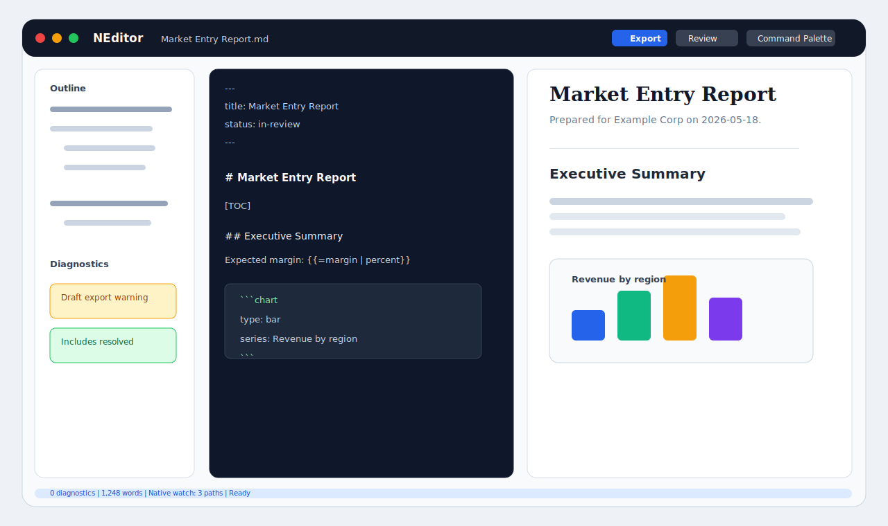
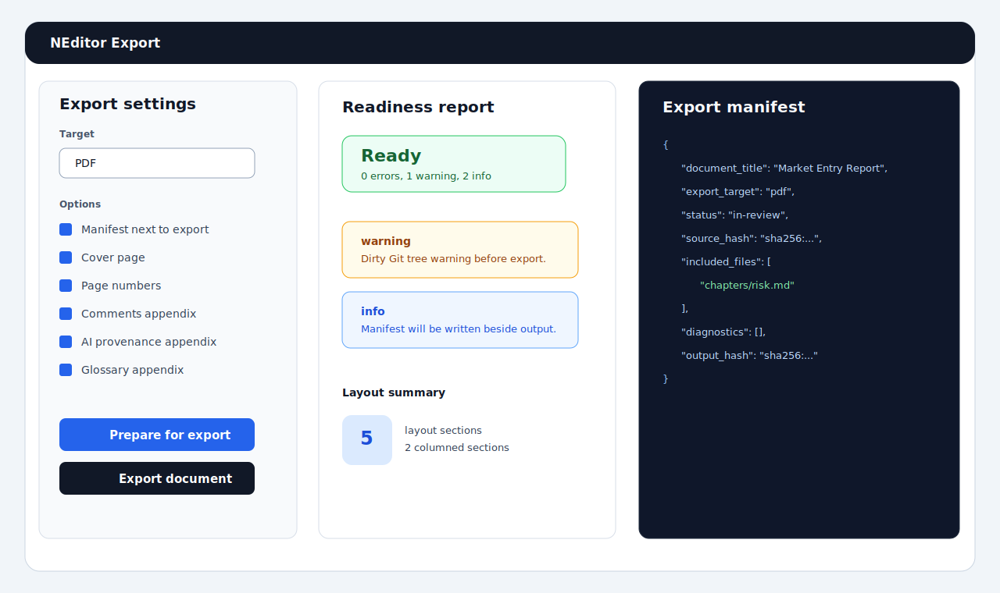
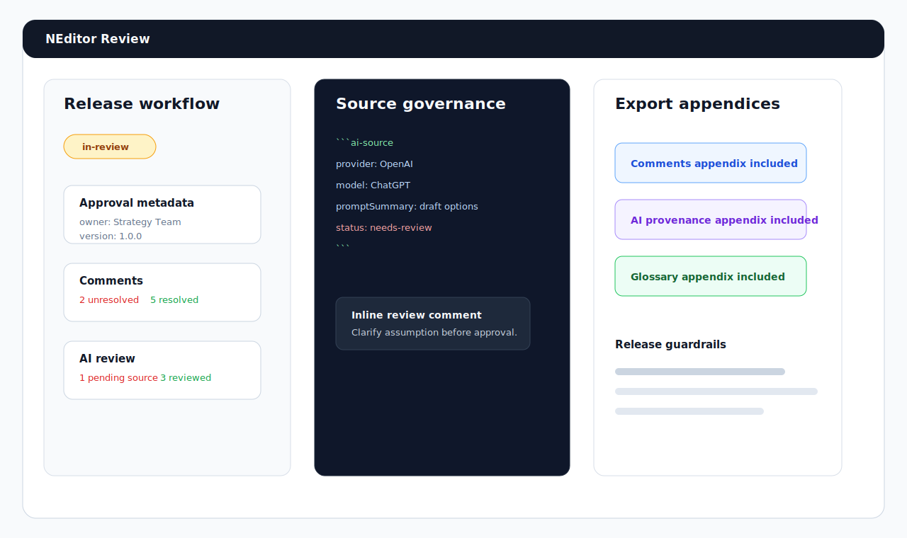
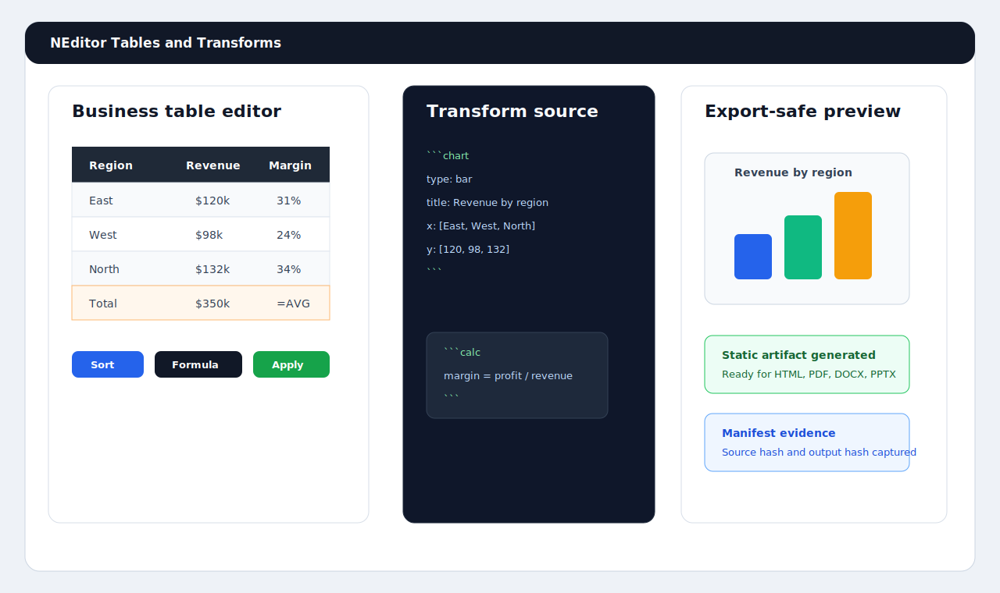

# NEditor

NEditor is a local-first Markdown workbench for serious business documents:
board papers, consulting reports, technical architecture notes, research
briefs, proposals, export packs, and AI-assisted drafts that still need human
governance.

It keeps the speed and readability of Markdown, then adds the things business
documents usually force into office suites: structured metadata, includes,
tables, calculations, citations, diagrams, review comments, release status,
brand-aware exports, and reproducible export manifests. Your source stays local
and inspectable. The app helps turn it into polished HTML, PDF, DOCX, PPTX,
Markdown bundle, blog, Substack, LaTeX, Google Docs package, or EPUB ebook
outputs.



## Start Here If You Just Want To Use NEditor

This section is for business users, managers, analysts, consultants, writers,
and reviewers who want to download NEditor and get work done. You do not need
to know Git, Node, Rust, Tauri, Markdown tooling, or command-line commands to
use the finished desktop app.

NEditor is meant to feel like a document app, not a developer tool. Open it,
create or open a document, write in readable plain text, review the formatted
preview, and export a polished file for the people who need it.

### What To Download

Use the NEditor package supplied by your organization, project team, or release
manager. If your team publishes release files, choose the one that matches your
computer:

| Your computer | Download this kind of file | Plain-language install step |
| --- | --- | --- |
| Mac | `.dmg`, `.zip`, or `NEditor.app` | Open the download, drag NEditor to Applications if prompted, then launch it like any other Mac app. |
| Mac with Homebrew | `brew install --cask <tap>/neditor` | Use this only after your organization publishes a signed and notarized Homebrew cask. |
| Windows | `.msi`, `.exe`, or a packaged `NEditor` app | Run the installer, then open NEditor from the Start menu or desktop shortcut. |
| Linux | `.AppImage`, `.deb`, `.rpm`, or a packaged desktop app | Install the package or mark the AppImage executable, then launch NEditor from your app menu. |

If you are reading this README in a source-code folder and do not see an
installer, you probably have the developer copy rather than the ready-to-use
desktop app. Ask IT or a technical teammate for the packaged NEditor download
for your operating system.

### Before You Install

Use this short checklist when NEditor is distributed inside a company:

- Download NEditor from the company-approved location, not from a forwarded
  attachment.
- Confirm the file name says NEditor and matches your operating system.
- Keep the installer somewhere ordinary, such as Downloads, until the app opens
  successfully.
- If your computer warns that the app is from an internal or unidentified
  developer, follow your organization's software approval process.
- Ask IT whether your company has a standard template folder, brand profile, or
  export settings to use with NEditor.

### First Run

1. Open NEditor.
2. Choose **New** for a blank document, or **Open** for an existing Markdown
   document.
3. Choose **Save** or **Save As** and put the file in a folder you control,
   such as a project folder, team drive, or client folder.
4. Use **Outline** mode when you want to plan the document first. Add chapters,
   sections, subsections, and subsubsections, then fill in the content.
5. Write in the editor. The preview shows how the final document will read.
6. Use **Export** when you need to share a polished copy.

NEditor documents are plain Markdown files. In practical terms, that means your
work lives in normal files and folders instead of being locked inside a cloud
account or proprietary database. Your team can store those files on a shared
drive, in a document-management folder, or in Git if your organization already
uses it.

### Command Line And Default Markdown Reader

Packaged developer and release builds include a command-line helper named
`ned`:

```sh
ned board-paper.md
ned init ~/Documents/client-pack --json
ned new proposal.md --template proposal --title "Client Expansion Proposal" --json
ned open board-paper.md --dry-run --json
ned convert board-paper.md --to pdf --output board-paper.pdf
ned convert board-paper.md --to pdf,docx,html --output-dir exports
ned convert board-paper.md --to html --stdout
cat board-paper.md | ned convert - --to latex --stdout
ned inspect board-paper.md --json
ned validate board-paper.md --to pdf --json
ned export proposal.md --to docx --output proposal.docx
ned templates --category Procurement --json
ned snippets --kind procurement --json
ned snippets --markdown review-handoff
ned profile --workspace . --set fullName="Jane Doe" --set companyName="Acme Advisory" --json
ned profile --workspace . --placeholders
ned targets --json
ned handlers --platform windows --commands-only
ned readiness --json
ned evidence --json
ned support-bundle --workspace . --output support.json
ned completions zsh
ned doctor --workspace . --json
ned default-reader --status --json
```

`ned file.md` and `ned open` launch NEditor with one or more Markdown files;
use `ned open file.md --dry-run --json` when a setup script needs to verify the
paths that would be handed to the app without opening a window.
`ned init` creates a reusable `.neditor` project scaffold with a business
profile, variables, standard business snippets, and a local-agent handoff folder;
use `--dry-run`
to preview the files and `--json` for help desk automation. `ned new` creates a
starter Markdown document from business templates such as proposal, RFP, RFP
response, RFQ, tender, tutorial, lesson plan, lesson content, technical textbook,
novel, podcast script, movie script, business case, and executive brief; add
`--json` for script-friendly creation status, selected template, title, output
path, and open status. `ned convert` and `ned export` run the same local export
pipeline used by the app for HTML, PDF, DOCX,
PPTX, Markdown bundle, blog, Substack, LaTeX, Google Docs package, and EPUB
outputs. Use comma-separated targets, or `--to all`, with `--output-dir` when
you need a complete delivery pack for review, legal, publishing, and archive
handoff. Text-safe exports such as HTML and LaTeX can write to stdout,
including piped Markdown input with `ned convert - --to html --stdout`; binary
package formats stay file-based to avoid corrupt terminal output. `ned
validate` and its alias `ned check` run the export-readiness
pipeline without writing an artifact; use `--json` for CI, and `--strict` when
warnings should fail a release gate. `ned inspect` reads a document or stdin
and reports title, status, outline, word counts, includes, transforms,
diagnostics, and available export targets without writing any artifacts. `ned
templates` explains the installed starter documents with categories, summaries,
and best-fit uses; use `ned templates --category Procurement --json` or
`ned templates --query podcast --ids-only` when help desk scripts need filtered
template discovery. `ned snippets` explains reusable standard document parts
such as contact blocks, company overview, scope, pricing assumptions, compliance
matrix, risk register, tender checklist, tutorial step, and review handoff; use
`ned snippets --markdown review-handoff` to print a copyable Markdown part or
`ned snippets --kind procurement --json` for filtered automation. `ned profile`
creates, updates, and prints the reusable name, email, phone, role, company,
address, website, industry, default client, and brand voice values that appear in
templates, snippets, Docs Live, and agent handoffs; use `--json` for help desks,
`--markdown` for a reusable identity block, and `--placeholders` for Docs Live
answers. `ned targets` lists export
formats, with `--json` output for help desk scripts and deployment checks. `ned
handlers` lists copyable setup plans for optional transform handlers such as
Graphviz, D2, PlantUML, Pikchr, and SQLite; use `--commands-only` when a support
script needs just the package-manager commands without starting installers. `ned
readiness` reads `.tmp/release-readiness/report.json` without rerunning the
verification suite and summarizes accepted checks, failed checks, external
evidence gaps, and next commands; use `--json` for packaging dashboards and
`--strict` when any remaining release gap should produce a non-zero exit code.
`ned evidence` reads the standard release evidence reports under `.tmp` (or a
directory supplied with `--evidence-root`) and summarizes which platform,
signing, Google Docs, AI, runtime, security, performance, rendered-export, and
accessibility evidence reports are ready, need attention, are missing, or have
failed. Use `ned evidence --strict` in support scripts when any report that
matters for production publishing should return a non-zero exit code.
`ned support-bundle` combines `ned doctor`, release-readiness,
spec-completion, transform-engine probe summaries, and standard release evidence
report statuses into a redaction-safe JSON handoff for help desks and release
managers. It includes setup status, command paths, report paths, evidence-gap
summaries, open specification rows, installed or missing transform-engine
status, AI/runtime/security/performance/sign-off evidence report status, and
recommendations, but not document content or secrets. `ned completions bash`,
`ned completions zsh`, and `ned completions fish` print shell completion
scripts so support teams can make the command easier to discover after
installation. `ned doctor` prints a local installation and workspace setup
report with the app binary, default-reader automation status, `.neditor`
scaffold status, transform handler setup coverage, export targets, and starter
templates; use `ned doctor --workspace . --json` when you want machine-readable
support evidence. In strict mode, missing or incomplete workspace scaffolding is
a warning and produces a non-zero exit code. `ned default-reader --status --json`
prints a machine-readable default Markdown reader setup plan with OS-specific
automation availability, copyable commands, manual steps, and next commands;
`ned default-reader --enable --json` returns non-zero if the platform requires
manual confirmation or if the helper command fails. In the app, open **Settings -> Files** to review the `ned` usage
summary and request NEditor as the default Markdown reader. Some operating
systems require user confirmation or a helper such as `duti`; NEditor shows the
exact commands and manual steps instead of silently changing protected OS
settings.

### Everyday Business Workflows

| I need to... | What to do in NEditor |
| --- | --- |
| Ask the app to plan and run the whole document workflow | Use **Agent** or **AI Agent Workspace**, describe the outcome in plain language, generate an agent packet, then apply the governed creation, revision, QA, and distribution output for human review. |
| Draft a board paper, proposal, report, or briefing note | Start in **Outline** mode, create the structure, then fill in each section. |
| Start from an AI-first document brief | Use **AI Create** to open Docs Live with an intent-first workflow for document type, outline, context, placeholders, QA, humanization, and review handoff. |
| Start a proposal, RFP, RFQ, tender, or tutorial | Open **Templates**, set up **Business info**, then use the **Document creation wizard** to insert a fillable template, open Docs Live, or prepare a Claude Code, Codex, or OpenCode handoff package. For RFPs, the native wizard turns each extracted requirement into a compliance row with a suggested response answer, evidence owner, verification note, and response section, then groups those answers into a **Requirement Response Drafts** section for the first response pass. The Agent Workspace can also write a governed local-agent handoff file under `.neditor/agent-handoffs` and verify whether the selected CLI is available on `PATH`. |
| Get to a first draft by talking through the document | Use **Docs Live** in the Writing toolbar, run **Check AI runtime** when you want proof that voice and clipboard capabilities are available, dictate the intent, add placeholder values, review the AI-created questionnaire, use or edit the context-aware suggested answers for each wizard step, review the section runbook and review packet, then apply the section-by-section draft with QA, humanization notes, and review handoff prompts. |
| Listen to a draft or selected passage | Use **Read Sel.** or **Read Doc** in the Writing toolbar, or configure **Read aloud** in Settings for browser speech, macOS Say, or Supertonic CLI. |
| Reuse a company format | Save your name, email, company, address, website, industry, client, and brand voice in **Business info**, then insert reusable document parts such as contact blocks, company overview, scope, pricing assumptions, compliance matrix, risk register, and review handoff. |
| Send a quick review copy | Use **HTML Export** for a clean, browser-readable file. |
| Send a client-facing document | Export to PDF or DOCX, depending on what the recipient expects. |
| Prepare slides or an executive handoff | Export to PPTX or use presentation mode to review the section flow. |
| Publish to a blog or Substack | Export the Blog or Substack package, then copy the prepared content into the publishing tool. |
| Continue editing in Google Docs | Export the Google Docs package, then import the included DOCX into Google Docs. |
| Share a long-form reader copy | Export the EPUB ebook, then open it in an EPUB reader before sending it. |
| Keep formal evidence for approvals | Use export manifests, review status, approval metadata, snapshots, and release tags when your team needs an audit trail. |
| Add calculations, charts, or diagrams | Insert a built-in transform template, replace the sample values, and preview the result. |

### What NEditor Helps With

- Long reports, proposals, business cases, strategy papers, research briefs, and
  technical documents.
- AI-guided document blueprints for board memos, operating procedures,
  technical architectures, ADRs, release notes, contract briefs, marketing
  briefs, customer case studies, tutorials, proposals, RFP responses, RFQ
  responses, and tender responses.
- Repeated business identity values and reusable document parts for standard
  proposals, procurement documents, tutorials, statements of work, capability
  statements, case studies, executive briefs, and review handoffs.
- Documents that need structured outlines before the body text is written.
- AI-first workflows where a business instruction should become a planned set
  of creation, editing, revision, review, and distribution actions.
- Voice-guided first drafts where an outline, context, and placeholder values
  should become a structured reviewable document.
- Repeatable exports where the same source can become HTML, PDF, DOCX, PPTX,
  Markdown bundle, blog, Substack, LaTeX, Google Docs, or EPUB handoff files.
- Review-heavy work where comments, approval metadata, release status, AI
  provenance, and export evidence matter.
- Local-first writing where files stay on your computer or in the folder system
  your organization already uses.

### When To Ask For Help

Most writing, review, file, and export workflows work directly inside NEditor.
Ask IT, a release manager, or a technical teammate when you need:

- A ready-made app package for your operating system.
- Help with a security warning during first launch.
- Company templates, brand profiles, export defaults, or approved cover-page
  settings.
- Approved local-agent usage policies for Claude Code, Codex, OpenCode, or
  other AI tools if your team wants agentic document co-writing.
- Optional diagram engines such as Graphviz, D2, PlantUML, or Pikchr.
- A shared folder, backup location, or Git repository for important documents.
- Signed or notarized installers for internal company distribution.

### Where To Learn More

- [User guide](docs/user-guide.md): practical writing, file, export, review,
  and troubleshooting guidance.
- [AI-first platform roadmap](docs/ai-first-platform-roadmap.md): 50 concrete
  changes for agentic composition, editing, review, distribution, governance,
  and verification.
- [Markdown extensions](docs/markdown-extensions.md): the extra document
  features NEditor understands.
- [External transform setup](docs/external-transforms.md): optional diagram and
  data engine setup for technical users.

## Why NEditor

Most Markdown editors are great for notes and weak for deliverables. Most office
suites are strong at formatting but poor at repeatability, review evidence, and
version control. NEditor is built for the middle ground: documents that need to
be written quickly, reviewed carefully, exported consistently, and audited later.

- **Local-first by design:** files, workspace state, snapshots, transform
  settings, and export outputs stay on your machine.
- **Markdown as source of truth:** readable text remains the canonical document,
  while the Rust compiler builds the semantic model used by preview and export.
- **Business-document aware:** front matter, release status, approval metadata,
  comments, citations, glossary terms, index terms, variables, formulas, and
  layout directives are first-class concepts.
- **Reference-ready:** the References sidebar helps manage citations, glossary
  entries, generated tables of contents, explicit index markers, generated
  indexes, index exclusions, captioned business objects, and generated
  figure/table lists without hand-editing every front matter block.
- **Repeatable exports:** every export can carry a manifest with source hashes,
  include hashes, options, diagnostics, app version, output path, and output
  hash evidence.
- **Safe extensibility:** diagram and data transforms use native renderers where
  possible, and external engines are trust-gated with timeouts, output limits,
  diagnostics, and deterministic cache keys.

## What NEditor Is Not

NEditor is deliberately scoped as a local-first, document-file-centered desktop
workbench. The first release is not trying to be a real-time multiplayer suite,
cloud document store, mobile app, full WYSIWYG editor, arbitrary plugin
marketplace, server-side renderer, enterprise identity layer, or browser-based
web app.

## Screenshots

| Writing workbench | Export readiness |
| --- | --- |
|  |  |

| Review and AI governance | Tables and transforms |
| --- | --- |
|  |  |

## Feature Tour

### Native Document Workbench

- Tauri 2 desktop shell with Vue 3, Pinia, Vite, CodeMirror 6, vanilla CSS, and
  a Rust command backend.
- Split source and preview, source-only, preview-only, focus, review,
  presentation, and export modes.
- Tabs with accessible move-left/move-right ordering controls, pinned
  documents, recent files, recently closed documents, recent folders, workspace
  folder browsing, restart-style workspace restore, and first-class
  document-set management for assigning, renaming, and removing open
  deliverable packs directly from the Files sidebar, with insertable or copyable
  Markdown manifests for reviewer and export handoff.
- CodeMirror editing with Markdown highlighting, diagnostics gutter, line
  numbers, word wrap, find/replace, smart list continuation, bracket pairing,
  word count, character count, and reading-time status.
- Keyboard-first operation for collapsed-toolbars and deep work: Cmd/Ctrl
  shortcuts cover save/save-as, new/open/open-folder, find, export, direct HTML
  export, bold/italic, command palette, Docs Live, AI Agent Workspace, Review
  readiness, Export readiness, and shortcut help.
- Command palette for app actions, natural-language AI agent instructions, AI
  route suggestions for Docs Live, AI Paste cleanup, Review, Export readiness,
  Outline mode, and provider handoff, plus document-aware navigation across
  headings, citations, glossary terms, index terms, open documents, workspace
  files, and recent Docs Live draft recovery actions.
- First-class outline planning in the Outline panel: draft a document structure
  with indented bullets, numbers, or Markdown headings, then create or append a
  Markdown document skeleton before writing the body text.
- AI Agent Workspace turns a plain-language instruction into an agentic plan
  across creation, composition, editing, revision, review, and distribution. It
  includes command-palette AI previews that show detected lanes, output targets,
  and missing inputs before generating a packet, searchable and filterable
  workflow playbooks for board approvals,
  client proposals, SOPs, strategy memos, policies, release notes, grant
  applications, technical/LaTeX papers, blog/Substack publishing, and executive
  revision passes, then identifies lanes, missing inputs, placeholder values,
  suggested outline, revision intent, export targets, runnable next steps, and
  context-aware optimal answers for each step that route into Docs Live,
  AI Paste cleanup, Review, Export readiness, Outline mode, or provider handoff. It
  gives users a dedicated **Context answers and constraints** field plus
  **Replan with answers** action so missing-input answers and per-step AI
  assistance become part of the context pack, placeholders, packet, Docs Live
  handoff, provider package, and saved run history. It also includes a
  **Source Pack Builder** for managing
  pasted notes, claims, URLs, file paths, references, and reviewer comments as
  structured grounding that flows into the agent plan, packet, Docs Live handoff,
  provider source pack, and saved history. Generated packets can be copied or
  appended as review material directly from the live run before users apply a
  replacement-mode output. Plans include a context completeness score across
  audience, evidence, constraints, examples, tone, and approval context so
  users know whether a responsible first draft has enough grounding. Revision
  plans also name the exact pass stack, including clarity, brevity, tone,
  evidence, legal caution, executive summary, accessibility, and humanization
  modes, so edits are auditable instead of opaque rewrites. It can also generate a
  complete agent packet with a Docs Live draft, selection-aware revision
  proposal, meaning-drift checks for changed numbers, dates, commitments, and
  caveats, an edit acceptance queue for accepting, rejecting, revising, and
  applying only approved edits item by item, document-type quality gates for
  board memos, proposals, policies, SOPs, research/technical documents,
  publishing drafts, and other supported business documents, a review comment
  resolution queue with per-comment required actions, resolution options, task
  notes, and blocker status, named reviewer agents for editorial, evidence, risk,
  citation, governance, and export readiness, a first-class claim inventory with
  source jumps, insertable/copyable audit tables, and one-click citation TODO
  creation for unsupported facts, deterministic outline critique
  for coverage, sequencing, duplication, depth, and specificity, deterministic
  humanization findings for generic, repetitive, vague, or overconfident
  language, a release evidence bundle for audit trail, source grounding, review
  closure, an Approval Metadata Gate that blocks distribution readiness until
  status, reviewer, approvedAt, owner, release target, source confidence,
  comments, and AI provenance are cleared, provider proof, distribution
  artifact requirements, and per-target export or publishing evidence obligations, a
  section-by-section work queue with drafting instructions, completion criteria, assigned reviewers, per-section
  work-brief insertion, and focused Docs Live handoff that can replace the
  matching Markdown section instead of appending duplicate section copy, an
  **AI Control Center** for readiness score, source grounding, governance
  state, current-document placeholders, citation TODOs, unresolved comments,
  extracted claim inventory, cross-reference integrity hints, humanization findings, unreviewed AI markers, approval metadata gaps,
  placeholder links, persistent review-sidebar visibility, runnable next
  actions in Agent Workspace and the Review sidebar that route document
  evidence into concrete remediation work, an
  agentic lifecycle task board that turns creation,
  composition, editing, revision, review, and distribution into runnable
  owned tasks with dedicated evidence-fix tasks, persistent
  queued/in-progress/needs-review/complete status, lane/status/search filters,
  task notes, insertable/copyable Markdown task briefs, target-specific
  distribution runbooks, an **Automation Scheduler** that can run the safe
  evidence scan, outline critique, transform validation, export preflight,
  accessibility review, and readiness-refresh queue without leaving the agent
  workspace, record per-check results, open the relevant remediation surface,
  persist the queued/running/complete/blocked automation breakdown in saved run
  history, and insert or copy an automation audit table, AI provenance,
  blockers, an Agent Audit Trail with run ID,
  fingerprints, rollback plan, review events, and safe apply behavior for
  replacing a document, replacing selected text, or appending a review packet.
  Recent generated/applied agent runs are kept in searchable local workspace
  history with status, lane, and target filters, run IDs, readiness, apply
  mode, provider, fingerprints, section/reviewer counts, a bounded packet
  snapshot that can be appended or copied later, filtered audit packages that
  can be inserted or copied for review evidence, per-run removal, full history
  clearing, and a replan action that restarts from the saved instruction
  against the current document context.
  Provider handoff packages turn that run into
  redacted prompts, source evidence packs with extracted claims, citation TODOs,
  humanization findings, outline critique, governance blockers, distribution
  blockers, lifecycle task-board context, reviewer/section work queues, JSON
  request bodies, headers, cURL starters, and safety checklists for
  approved AI providers, localhost gateways, or private-network model gateways without storing secrets in the
  document. If policy allows direct calls, users can run the
  request with a session-only API key, preview the provider's Markdown response,
  and apply it as review material without persisting the secret; imported
  provider responses are wrapped in local `ai-source` and `ai-assisted`
  needs-review provenance before they enter the document, and provider-applied
  history records the wrapped review draft that was actually inserted.
  The References panel also includes a Citation TODO workflow for adding,
  resolving, deferring, jumping to, and exporting citation blockers as a
  reviewer-ready Markdown audit. It also exposes front matter and merged
  project variables from `.neditor/variables.yaml` as insertable placeholders
  with filters, so repeated client, owner, budget, and source values do not
  require hand-written `{{variable}}` syntax.
  The Help Center and guided demo include AI Governance steps that show
  non-technical users how to route lifecycle tasks, insert or copy task briefs,
  review provider packages, and apply provider output only as governed
  needs-review material. The guided demo also persists local step completion
  and can insert or copy a Markdown onboarding checklist for trainers,
  reviewers, or rollout notes.
- AI Create makes Docs Live the default first step for intent-led drafting,
  so users can begin with the outcome, audience, context, and placeholders
  instead of a blank page.
- Docs Live can take that outline plus freeform context, outline-aware
  questionnaire answers, dictated direction, and placeholder values managed in
  a structured table for clients, owners, dates, evidence, reviewers, amounts,
  and reusable variables. Each placeholder can also carry a type, source or
  evidence note, and review status, then flow into the generated draft inputs
  table before section-by-section drafting, QA gates, humanization cleanup, and
  review handoff notes. Docs Live also proposes context-aware suggested answers
  for each wizard step from the selected document type, title, outline,
  placeholders, dictated direction, and existing context; users can accept one
  answer at a time or append all suggestions before generating. Its review
  packet shows the context sources, section
  work queue, assumption register, humanization checklist, and reviewer handoff
  before the draft is applied. The packet itself can be inserted or copied as a
  standalone audit handoff, and generated drafts can be copied or appended as
  review material without replacing the current document. Recent drafts are
  kept in a bounded local history with append/copy and packet handoff actions
  plus remove/clear controls so a generated first draft remains recoverable
  after the modal is closed without trapping stale AI output forever.
  **Check AI runtime** produces a content-free
  readiness report for secure context, Web Speech availability, microphone
  permission, and clipboard read/write support so business users can confirm
  that dictation and clipboard-assisted AI workflows are usable on the current
  machine without storing clipboard text.
- **Read aloud** can speak the current editor selection or the full Markdown
  document. Browser speech works inside the app runtime; native desktop builds
  can use macOS Say; and teams that install Supertonic can point NEditor at the
  `supertonic` CLI for local on-device TTS. These settings store provider
  choices and command names, not audio recordings or document copies.
- The Templates panel now includes a business identity setup dialog for your
  name, email, phone, role, company, address, website, industry, default client,
  and brand voice; common business-development document builders for tutorials,
  proposals, RFPs, RFQs, tenders, statements of work, capability statements,
  case studies, business cases, and executive briefs; reusable semi-template
  document parts; and handoff options for Claude Code, Codex, and OpenCode.
  Each document builder shows context-aware AI step assistance for identity,
  intent, outline, sequential drafting, QA, and humanization so non-technical
  users can accept or adapt suggested optimal answers before opening Docs Live
  or handing work to an agent.
  The Agent Workspace can prepare those local-agent handoffs as actual Markdown
  files in the current document workspace, return the exact launch command, and
  warn when the chosen CLI is not installed.
- Separate preferences for theme, preview theme, typography, editor behavior,
  autosave, snapshots, export defaults, bibliography defaults, brand defaults,
  Git integration, AI cleanup, and transform engines.

### Compiler And Document Intelligence

- YAML front matter for title, subtitle, author, client, date, classification,
  status, version, release metadata, brand settings, layout settings, TOC,
  citation style, variables, and export controls.
- Include expansion for modular master documents, with relative resolution,
  child front-matter stripping, include graph tracking, source/include hashing,
  and diagnostics for missing or circular includes.
- Document variables, default variables, project variables, inline formulas,
  calculation blocks, table formulas, UI insertion for merged metadata
  variables, and dependency diagnostics.
- Automatic table of contents, glossary, index, bibliography, source maps,
  export manifests, semantic AST, paged-document model, diagnostics, and
  transform artifacts.
- Cross references for headings, figures, tables, equations, appendices, and
  decision records, with broken-reference diagnostics and a References sidebar
  inventory for jumping to source labels or inserting reusable links.
- Rich document blocks for callouts, equations, figures, captions, layout
  sections, review comments, change notes, AI provenance, and approval metadata.

### Tables, Data, And Calculations

- Visual Markdown table editor with paste import, row and column editing,
  alignment, numeric sorting, column formats, totals, formula rows, merged-cell
  metadata, CSV/TSV/XLSX import, CSV/XLSX export, cancel/apply workflows, and
  readable Markdown output.
- Markdown tables, CSV fences, and TSV fences can carry formulas such as
  `=10+15`, `=SUM(2,3)`, and named table references.
- Data transforms for CSV, TSV, JSON, YAML, SQLite SQL, OpenAPI, and JSON
  Schema produce preview/export-safe artifacts. SQL transforms are read-only
  SQLite table queries behind explicit engine trust, and relative database paths
  resolve from the current Markdown document's folder without allowing relative
  escapes outside that folder.

### Diagrams And Transform Blocks

NEditor includes a fenced-code transform registry for static, export-safe
artifacts:

- `calc` for document calculations.
- `chart` for bar, line, pie, area, and KPI charts.
- `mermaid`, `pikchr`, DOT/Graphviz, D2, and PlantUML for diagrams.
- `vega-lite`, GeoJSON, TopoJSON, STL, `timeline`, `glossary`, `bibtex`,
  OpenAPI, JSON Schema, JSON, YAML, CSV, TSV, and read-only SQLite SQL.
- Native Rust renderers or fallbacks are used where practical.
- External executable engines require explicit trust, bounded execution, and
  clear setup/probe diagnostics.
- Settings -> Transforms includes a transform handler installer. It shows the
  exact package-manager commands for every external transform handler
  currently registered by NEditor: SQLite, Pikchr, Graphviz/DOT variants, D2,
  and PlantUML. It can start the supported allowlisted installer on the current
  platform, and falls back to copyable commands when the platform needs
  terminal/admin setup.

### Review, Release, And AI Governance

- Release statuses such as draft, in-review, approved, published, and archived.
- Approval Metadata Gate validation before release-grade exports and publishing
  handoffs, including an insertable scaffold for missing status, reviewer,
  approvedAt, owner, release target, and source confidence fields.
- Inline review comments, unresolved-comment validation, change notes, and
  export appendix options.
- AI paste cleanup for chat output, code fences, bullets, tables, links,
  citation TODOs, insertion modes, and provenance markers.
- AI-source and AI-assisted section tracking so generated material can be
  marked as needing review or human-reviewed before export.

### Local Files, Safety, And Versioning

- New, open, open folder, save, save as, revert, rename, duplicate, reveal,
  recent documents, recent folders, and workspace restore flows.
- On-disk hash guards prevent stale saves from silently overwriting external
  edits.
- File watchers track the root document and included files. Clean documents
  reload or recompile; dirty documents open a conflict workflow with compare,
  accept external, keep local, and save-copy actions.
- Git integration for repository detection, branch/dirty state, commit, history,
  diff, restore, tag, and dirty-export warnings.
- Git-free snapshots for non-Git users, including manual, automatic, and
  pre-export snapshot paths.

### Export System

NEditor exports from the compiled semantic document model rather than treating
preview HTML as the only source of truth.
HTML export is available as a first-class File menu action (`File` -> `Export`
-> `HTML Export`), a toolbar command, a command-palette command, and the default
Export panel target.
EPUB export is also directly available from `File` -> `Export` -> `EPUB Export`,
the document toolbar, the Export panel, and the command palette for ebook
handoffs that should not require hunting through the target picker first.

| Target | What it is for | Current support |
| --- | --- | --- |
| HTML | Web previews, review copies, static publishing | Standalone document metadata, language, canonical links, styles, syntax highlighting, semantic sections, transform artifacts, manifests |
| PDF | Board papers, reports, proposals, release packs | Paged layout model, page options, headers/footers, watermarks, tables, figures |
| DOCX | Word-compatible client deliverables | Document structure, paragraphs, tables, comments/provenance appendices, manifests |
| PPTX | Presentation-style summaries and executive decks | Slide packaging, agenda option, table splitting, manifest sidecars |
| Markdown bundle | Portable source handoff | Source document plus manifest and packaged evidence |
| Blog package | Blog publishing handoff | Copy-ready Markdown, HTML, text, publish workflow metadata, RSS seed, assets, and manifest |
| Substack package | Substack publishing handoff | Substack copy HTML, Markdown, text, publish workflow metadata, RSS seed, assets, and manifest |
| LaTeX | Academic or technical handoff | `.tex` source with metadata, headings, tables, figures, equations, links, and labels |
| Google Docs package | Google Docs import handoff | DOCX, HTML, Markdown, text, import workflow metadata, assets, and manifest |
| EPUB ebook | Portable long-form reader handoff | `.epub` package with EPUB metadata, navigation, XHTML body, styles, text fallback, packaged media, and embedded NEditor manifest |

Export defaults include manifests, styles, syntax highlighting, HTML language,
HTML description, canonical URL, cover page, page numbers, layout preset,
comments appendix, AI provenance appendix, glossary appendix, PPTX agenda,
citation style, brand profile, dirty-Git warnings, transform engine settings,
and draft watermark behavior.

## Example Projects

The repository ships example documents that compile and export through the
supported targets:

- [Board paper](examples/board-paper.md)
- [Consulting report with includes](examples/consulting-report.md)
- [Technical architecture document](examples/technical-architecture.md)
- [Research report with bibliography](examples/research-report.md)
- [Proposal with budget tables and formulas](examples/proposal-budget.md)
- [AI-assisted draft with review provenance](examples/ai-assisted-draft.md)

These examples are covered by Rust fixture tests so they stay executable instead
of becoming stale marketing samples. The tests also keep the README links in
sync and prove each example's audience metadata and representative features
survive HTML, PDF, DOCX, PPTX, and Markdown bundle exports. Each example also
declares local-first positioning metadata, and export tests prove that the
delivery model and Markdown source-of-truth survive HTML metadata, Office custom
properties, and Markdown bundle metadata.

## Planning Documents

- [AI-first platform roadmap](docs/ai-first-platform-roadmap.md): 50 concrete
  changes for making composition, document creation, editing, revision, review,
  distribution, governance, provider handoff, and verification agentic.
- [Specification completion matrix](docs/spec-completion-matrix.md): current
  implementation evidence and remaining release risks against the product spec.

`pnpm run check:spec-completion` turns that matrix into an executable release
contract. It writes `.tmp/spec-completion/report.json`, validates every matrix
row has a recognized status, direct evidence, and a substantive remaining gap
when still Partial, Unverified, or Missing, and feeds open rows into release
readiness as explicit production risks.

## Developer Quick Start

```sh
pnpm install
pnpm run build
./node_modules/.bin/tauri dev
```

Use the project-local Tauri binary for desktop commands. It avoids package
manager fetches in restricted-network environments.

## Verification

```sh
pnpm run verify:local
pnpm run verify:local:full
```

NEditor uses local verification as the normal development gate, with a
manually dispatched GitHub Actions workflow for browser, Windows, and Linux
release evidence that cannot be collected from every workstation. Run
`pnpm run verify:local` before publishing a normal slice. Run
`pnpm run verify:local:full` for a release-grade baseline; it extends the quick
checks with the production build, the full browser workflow suite, the focused
runtime accessibility audit, the manual accessibility review contract, optional
engine probe, native-watch check, clippy, full Rust tests, rendered export audit,
platform package configuration audit, Tauri no-bundle release compile, macOS
`.app` bundle build/smoke and DMG classification on macOS, desktop artifact
smoke, bounded macOS GUI launch smoke on macOS, and the desktop WebDriver smoke
or platform skip evidence.

Use `pnpm run verify:local -- --list` or
`pnpm run verify:local:full -- --list` to print the exact command sequence
without running it. Quick verification now includes the same browser environment
preflight exposed by `pnpm run check:e2e-env`,
which proves the current host can launch Chromium through NEditor's Playwright
wrapper. The full baseline runs the same browser suite exposed by
`pnpm run test:e2e`; the runner prefers
Playwright's workspace-local browser cache at `.tmp/ms-playwright` and falls
back to an installed Chrome-compatible browser when that cache is missing. To
refresh that local browser cache, run:

```sh
PLAYWRIGHT_BROWSERS_PATH=.tmp/ms-playwright pnpm exec playwright install chromium
```

Use `pnpm run check:e2e-env` before browser workflow runs. It defaults to the
project-local Playwright browser cache, records the browser source under
`.tmp/e2e-environment/report.json`, and runs the focused workbench boot workflow
through the same Playwright CLI path as the full browser suite. The check retries
transient browser launch failures, such as macOS headless Chrome closing before
app assertions, while still failing immediately for real workflow assertion
failures.

`pnpm run check:engines` probes optional external transform engines and reports
installed/missing Graphviz/DOT variants, D2, PlantUML, Java-backed PlantUML,
Pikchr, and SQLite `sqlite3` paths without failing just because an optional
engine is absent. For each installed diagram engine it renders a small SVG smoke
artifact through the adapter shape NEditor uses; for SQLite it runs a read-only
in-memory CSV query. The probe writes those artifacts under
`.tmp/external-engines/artifacts/` and records paths, versions, byte counts, and
compatibility status in
`.tmp/external-engines/probe-report.json` for local platform evidence. It also
writes JSON templates under `.tmp/external-engines/templates/` and accepts
validated copied proof from `NEDITOR_EXTERNAL_ENGINE_EVIDENCE_DIR` or
`.tmp/external-engines/external/`, so a missing local optional engine such as
Pikchr or sqlite3 can be closed by real evidence from a host where that engine is
installed.

`pnpm run check:deps` verifies that every JavaScript and Rust dependency in the
project manifests has an entry in the dependency admission record and that
NEditor package metadata still declares MIT licensing.

`pnpm run check:platform-packaging` verifies cross-platform package
configuration without requiring a Windows or Linux host. It checks synchronized
npm/Cargo/Tauri version and license metadata, all-platform Tauri bundle targets,
the packaged `ned` sidecar contract, Markdown file associations,
macOS/Windows/Linux icon coverage, production desktop window dimensions, CSP
guardrails, root MIT license linkage, and writes
`.tmp/desktop-bundle/platform-package-config-report.json` with the current
`unsigned-local-builds` signing stance. Release distribution signing,
notarization, and installer attestation remain credentialed release steps outside
local verification.

`pnpm run check:homebrew` verifies the Homebrew cask packaging contract for
macOS distribution. It checks the cask template under
`packaging/homebrew/Casks/neditor.rb.template`, the README and
`docs/homebrew-distribution.md` runbook, Tauri app metadata, bundle target
coverage, the exposed `ned` command-line helper, and optional release
cask/artifact SHA evidence when
`NEDITOR_HOMEBREW_CASK` and `NEDITOR_HOMEBREW_ARTIFACT` are supplied. The check
passes the repository configuration while still reporting release blockers until
a real SHA-pinned, signed, and notarized macOS artifact is available.

`pnpm run check:platform-evidence` writes
`.tmp/platform-evidence/report.json` and creates JSON templates under
`.tmp/platform-evidence/templates/` for Windows and Linux package/WebDriver
evidence. Missing supported-host evidence remains a release gap, but malformed
evidence copied back from another host fails the check instead of being silently
accepted.

`pnpm run check:release-ci` verifies that
`.github/workflows/neditor-release-evidence.yml` remains wired to run the
browser workflow suite on Ubuntu plus strict Windows/Linux Tauri WebDriver and
package evidence collection. It also uploads rendered export and accessibility
review packages containing the dashboards, templates, reports, screenshots, and
manual sign-off contracts needed by human reviewers. Trigger that workflow
manually when release readiness needs supported-host proof, then download the
uploaded evidence artifacts and import returned completed sign-offs locally with
`pnpm run ingest:evidence -- --source /path/to/unpacked-artifacts`.

`pnpm run collect:evidence-kit` packages the current release-readiness gaps into
a reviewer-friendly bundle with runbooks, templates, return paths, validator
commands, ingest commands, and final release-readiness commands for platform
evidence, signing, live AI provider/runtime proof, independent security review,
Google Docs import, release-device performance profiling, human review sign-offs,
optional external engines such as Pikchr, and spec-completion closure work. The
kit contract now fails if a readiness gap cannot be closed from a generated work
item with at least one runbook, returned evidence path, validator command, and
`pnpm run check:release-readiness` handoff. The ingest tool
recognizes returned security review proof under paths such as
`security/security-review.json`, performance profile proof under paths such as
`performance/native-profile.json`, and optional-engine proof under paths such as
`external-engines/external/pikchr.json`, then validates them through
`pnpm run check:security-review`, `pnpm run check:performance-profile`, and
`pnpm run check:engines`.

On the Windows or Linux host that produced the package and WebDriver evidence,
run `pnpm run collect:platform-evidence` after `pnpm run test:tauri-webdriver`
and the Tauri package build. It scans real installer/package artifacts, copies
the passing WebDriver report, and writes the supported-host evidence JSON under
`.tmp/platform-evidence/external/<platform>/` so the files can be copied back
and validated with `pnpm run check:platform-evidence`.

`pnpm run check:release-signing` writes `.tmp/release-signing/report.json` and
creates JSON templates under `.tmp/release-signing/templates/` for macOS
codesign/notarization, Windows Authenticode/timestamp, and Linux package
signature/checksum evidence. Missing credentialed signing proof remains a
release gap; malformed supplied evidence fails the check.
On credentialed release hosts, `pnpm run collect:release-signing -- --artifact
kind=/path/to/artifact --proof kind='verification command'` hashes signed
artifacts, runs verifier commands, and writes
`.tmp/release-signing/external/<platform>/signing-evidence.json` for
`pnpm run check:release-signing`.

`pnpm run check:google-docs-import` writes
`.tmp/google-docs-import/report.json`, verifies the local rendered Google Docs
handoff DOCX/package, and creates
`.tmp/google-docs-import/import-evidence.template.json` for live Google Docs
import/readback proof. Missing Drive authorization remains a release gap;
malformed supplied import evidence fails the check.

`pnpm run check:ai-provider` writes `.tmp/ai-provider-evidence/report.json`
and creates `.tmp/ai-provider-evidence/templates/provider-evidence.template.json`
for live approved-provider endpoint proof. Missing credentials remain a release
gap, but malformed supplied evidence, stale source commits, dirty source-tree
claims, missing response hashes, missing `NEDITOR_PROVIDER_EVIDENCE_OK` markers,
or API-key-looking secrets fail validation. On a credentialed host, run
`pnpm run collect:ai-provider` with `NEDITOR_AI_PROVIDER_PROFILE`,
`NEDITOR_AI_PROVIDER_ENDPOINT`, `NEDITOR_AI_PROVIDER_MODEL`, and
`NEDITOR_AI_PROVIDER_API_KEY_ENV` set. The collector sends a bounded readiness
prompt, stores only hashes, endpoint host/path, model, status, and a short
secret-free response preview, then writes
`.tmp/ai-provider-evidence/external/provider-evidence.json`.

`pnpm run check:ai-runtime` writes `.tmp/ai-runtime-evidence/report.json` and
creates `.tmp/ai-runtime-evidence/templates/runtime-evidence.template.json` for
real Docs Live runtime proof. The validator accepts only current-source evidence
that proves secure context, SpeechRecognition availability, granted microphone
permission or stream-opened proof without stored audio, and clipboard read/write
success without stored clipboard content. Missing real-device evidence remains a
release gap; malformed evidence, stale commits, recorded audio samples, or
clipboard text fail validation.

`pnpm run check:security-review` writes `.tmp/security-review/report.json` and
creates `.tmp/security-review/templates/security-review.template.json` for
independent security review sign-off. The validator accepts only current-source,
clean-tree evidence from an independent reviewer, requires the documented trust
boundaries and reviewed artifacts to be covered, rejects unresolved critical or
high findings, requires report hashes, and confirms no secrets, telemetry, or
unreviewed external/provider execution paths were introduced.

`pnpm run check:release-readiness` aggregates the current local proof set into
`.tmp/release-readiness/report.json`. It fails if required current-host reports
are missing or failed, and otherwise records remaining external evidence gaps
such as Windows/Linux package artifacts, Windows/Linux WebDriver execution,
release signing/notarization, live approved-provider endpoint proof, real Docs
Live runtime device proof, independent security review sign-off, Google Docs
live import/readback, open specification matrix rows, optional missing engines,
and human reviewer sign-off for accessibility or native-viewer export review.
`ned readiness --json` reads that generated report for support, release, and
packaging handoffs; `ned readiness --strict` exits non-zero until the report is
publication-ready with no failed checks or evidence gaps.
`ned evidence --json` reads the same standard release evidence reports that feed
release readiness and produces a support-friendly status summary for platform,
signing, Google Docs, AI provider, AI runtime, performance, security, rendered
export, and accessibility sign-off evidence.
`ned support-bundle --output support.json` packages the local setup diagnostics,
release-readiness summary, spec-completion summary, and transform-engine probe
summary into one supportable JSON file without including document content or
secrets. Pass `--evidence-root .tmp` explicitly when the standard release
evidence reports have been copied into a non-default evidence directory.

`pnpm run test:rendered-exports` runs the representative rendered export audit
and writes local review artifacts to `.tmp/rendered-export-audit`: HTML, PDF,
DOCX, PPTX, Markdown bundle, blog package, Substack package, LaTeX, Google Docs
package, EPUB ebook, hashes, a manual visual-review checklist, and `viewer-proof.json` with
executable HTML/PDF/DOCX/PPTX/package assertions, publishing handoff workflow
metadata checks, LaTeX source checks, Google Docs import workflow checks, EPUB
package checks, and nested Google Docs DOCX checks. It also writes
`visual-review-summary.json`, which maps export targets and review cases to
browser screenshots, PDF raster thumbnails, generated DOCX/PPTX Office preview
dashboards, native tool proof, skipped host-limitation records, and human
sign-off state. It also writes `automated-visual-review.json`, a current-host
automated visual review report that requires browser-rendered HTML screenshots,
PDF raster proof, Office XML preview extraction, Office preview screenshots, and
mapped proof for every primary and review-case target before marking the audit
`automated-reviewed`. The audit also writes
`visual-review-signoff.template.json`; fill a copy and rerun with
`NEDITOR_RENDERED_EXPORT_SIGNOFF=/path/to/signoff.json pnpm run test:rendered-exports -- --validate-signoff-only`
to validate completed manual native-viewer review against the existing audit
bundle. Completed sign-off must use the
`neditor.rendered-export.visual-signoff.v1` schema, include reviewer metadata
and native viewer names, and preserve the byte counts plus SHA-256 hashes for
the exact generated artifacts under review. On macOS it also extracts DOCX text
through `textutil` and attempts bounded Quick Look PDF/DOCX/PPTX thumbnail proof,
recording either thumbnail assertions or host sandbox limitations in
`viewer-proof.json`. When `pdflatex` is installed, it also compiles the
generated `.tex` file into `.tmp/rendered-export-audit/latex-compile/`.

`pnpm run test:performance-audit` writes `.tmp/performance-audit/report.json`
after running the Rust performance stress tests and the focused browser
large-document workflow through the project-local Playwright browser cache.

`pnpm run check:performance-profile` writes
`.tmp/performance-profile/report.json` and creates
`.tmp/performance-profile/templates/native-profile.template.json` for sustained
release-device native profiling evidence. Missing profile evidence remains a
release gap, but malformed supplied evidence fails validation. Accepted proof
must match the current app version, current Git commit, and clean source tree,
cover at least a 30 minute Tauri release-device session, include startup/open,
large-document edit/preview, export, native file-watch conflict, and Agent
Workspace review scenarios, and store profiler artifact hashes instead of raw
trace data.

`pnpm run test:desktop-smoke` verifies the local Vite build, Tauri
configuration, package metadata, MIT license metadata, release desktop binary
produced by `./node_modules/.bin/tauri build --no-bundle`, and a native
command workflow smoke that opens, watches, compiles, checks readiness, exports,
and reveals real local files through the Rust command surface. The command writes
`.tmp/desktop-smoke/native-command-report.json` with binary/build metadata and
native command workflow duration. On machines that allow GUI app startup, run
`NEDITOR_DESKTOP_SMOKE_LAUNCH=1 pnpm run test:desktop-smoke` for a bounded
native launch smoke. This launch smoke is part of the full local baseline on
macOS, so release-grade verification proves the app-authored Tauri window and
workflow reports instead of relying only on artifact inspection. The launch
smoke writes
`.tmp/desktop-smoke/launch-report.json` with the binary path, PID, elapsed
window, captured output, and `processAlive: true` evidence when the app remains
running until the timeout, plus `.tmp/desktop-smoke/native-window-report.json`
with app-authored package, identifier, main-window title, visibility, size, and
scale-factor evidence, `.tmp/desktop-smoke/native-ui-report.json` with rendered
workbench surface evidence, and `.tmp/desktop-smoke/native-workflow-report.json`
with native mode, real-file, conflict, transform-template, readiness, HTML
export, and guarded native menu-event export evidence.

`pnpm run test:desktop-bundle` verifies the current host's packaged desktop
bundle evidence. On macOS it checks `NEditor.app` Info.plist metadata, bundle
identifier, version, executable, icon, copyright, and high-resolution flag after
`./node_modules/.bin/tauri build --bundles app`.

`pnpm run test:desktop-dmg` verifies macOS DMG packaging when this host can run
`hdiutil`. In restricted execution environments it records the known sandboxed
`hdiutil create` failure as `.tmp/desktop-bundle/macos-dmg-report.json` instead
of treating it as app-bundle or metadata regression.

`pnpm run test:tauri-webdriver` runs the Tauri WebDriver desktop smoke on
Windows and Linux hosts with `tauri-driver` plus the platform WebDriver
installed. The harness starts the built desktop binary, checks the native title,
switches view mode, opens the command palette, creates a dirty document and
checks the native dirty-title marker, inserts a Science calc template through
the Templates panel, saves and reopens a real Markdown file through the guarded
dialog-free smoke path, renames, duplicates, and reveals deterministic Markdown
files, runs export readiness through the desktop command path, writes a real HTML
export, validates the sidecar manifest/output hash, and verifies selected
preferences survive a desktop session restart before restoring them. It writes
`.tmp/desktop-webdriver/report.json` with dependency, assertion, file artifact,
export artifact, pass, or skip evidence. On macOS, official Tauri WebDriver is
skipped because the supported stack does not provide a WKWebView driver; use the
bounded desktop launch smoke there. When the bounded launch smoke has already
run on macOS, the WebDriver report also records `fallbackProof` from
`.tmp/desktop-smoke/native-command-report.json` so the skip still points to
current app-authored native file, export, workspace, snapshot, and UI evidence.
The fallback proof is freshness-checked against the built desktop binary and
the bounded launch report so stale `.tmp` native reports cannot satisfy the
WebDriver evidence contract.

`cargo check` and `cargo test` require crates.io access the first time Rust
dependencies are resolved. After dependencies are present, the project is
designed to verify without global tools beyond the checked-in package managers
and local toolchains.

## Packaging Notes

```sh
pnpm run prepare:sidecars
pnpm run build
./node_modules/.bin/tauri build --no-bundle
./node_modules/.bin/tauri build --bundles app
pnpm run test:desktop-bundle
pnpm run test:desktop-dmg
```

`pnpm run prepare:sidecars` builds the release `ned` helper and copies it to the
target-triple sidecar name that Tauri expects from `bundle.externalBin`.
`tauri build` also runs that step through `beforeBuildCommand`, so release hosts
cannot accidentally package NEditor without the CLI helper.

On macOS, `.app` bundle creation is part of `pnpm run verify:local:full` and the
bundle checker writes `.tmp/desktop-bundle/macos-app-report.json`. The DMG
checker writes `.tmp/desktop-bundle/macos-dmg-report.json`; on this sandboxed
host, `hdiutil create` cannot start `hdiejectd` and returns `Device not
configured`, which classifies the failure as host-specific rather than an app
bundle regression.

## Project Status

NEditor is under active development and already has a broad implemented surface:
compiler, workbench UI, local file flows, conflict handling, transform registry,
review governance, AI cleanup, export readiness, export targets, example
fixtures, and local verification coverage. The remaining hardening work is
tracked conservatively in:

- [Specification](docs/specification.md)
- [User guide](docs/user-guide.md)
- [Markdown extensions](docs/markdown-extensions.md)
- [External transform setup](docs/external-transforms.md)
- [Storage model](docs/storage-model.md)
- [Security threat model](docs/security-threat-model.md)
- [Completion matrix](docs/spec-completion-matrix.md)
- [Current backlog](docs/todo.md)
- [Progress log](docs/progress.md)

Rows in the completion matrix move to complete only when current code, tests,
workflow evidence, artifacts, and platform checks prove the requirement.
`pnpm run check:spec-completion` enforces that discipline locally and
`pnpm run check:release-readiness` keeps any open matrix rows visible in the
release-readiness report until they are closed by direct evidence.

## License

NEditor is released under the [MIT License](LICENSE). The npm package,
Cargo crate, and desktop bundle metadata all declare MIT licensing.
