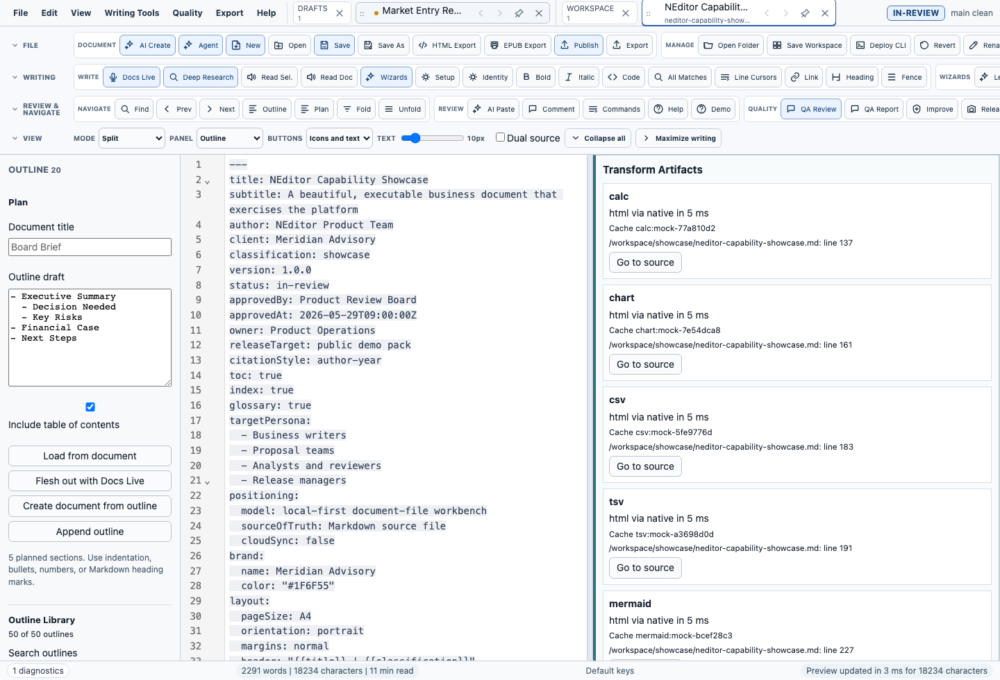
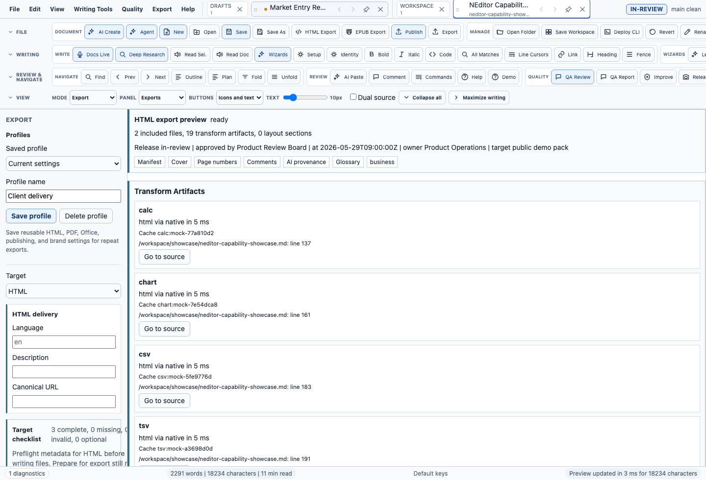
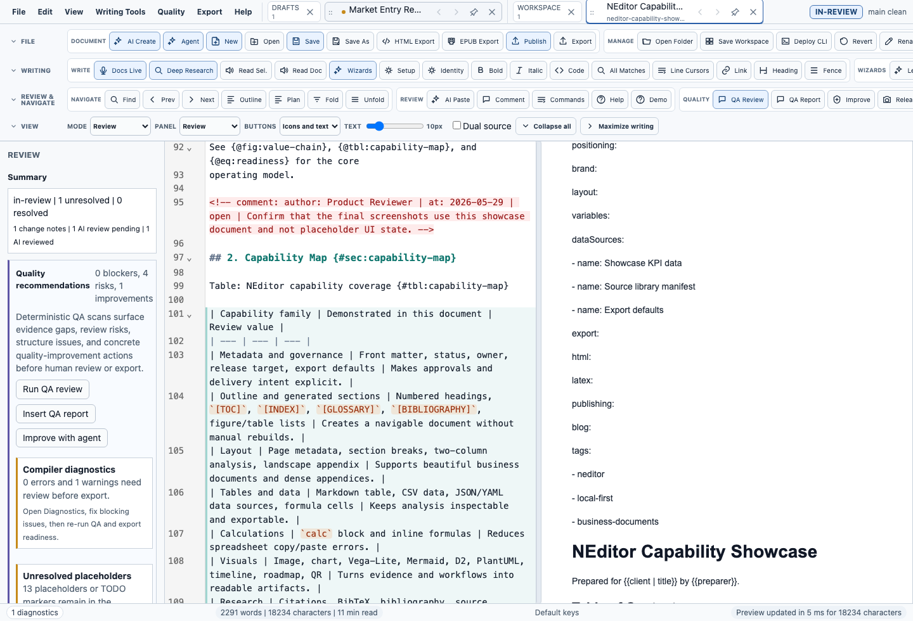
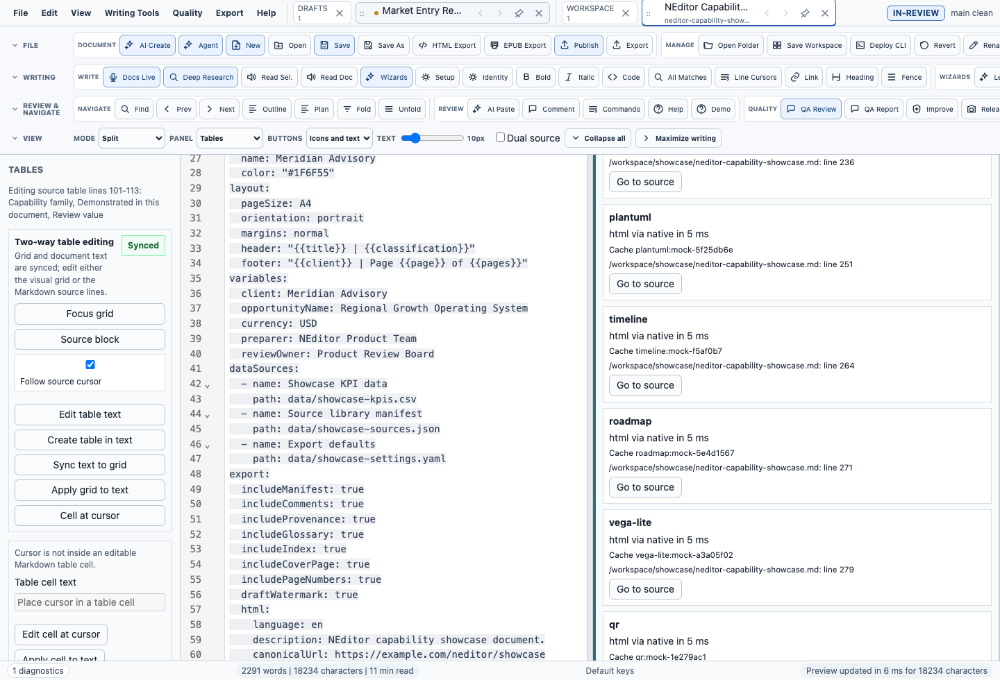

# NEditor

NEditor is a local-first Markdown workbench for serious business documents:
proposals, RFP responses, board papers, consulting reports, research briefs,
technical docs, books, scripts, and publishable export packages.

It keeps the source readable and portable, then adds the business-document
features Markdown normally lacks: outlines, includes, tables, equations,
citations, AI-assisted drafting, review gates, reusable snippets, brand-aware
exports, publishing packages, and release evidence.



## What It Does

- **Write and organize documents** with Markdown, live preview, outline mode,
  folding, search, tabs, includes, comments, and document maps.
- **Create documents with AI assistance** through Docs Live, adaptive wizards,
  section-by-section drafting, quality checks, humanization, and agentic review
  packets.
- **Handle business workflows** with reusable company profiles, snippets,
  templates, RFP response tools, compliance matrices, deep research, citations,
  and source-document management.
- **Work with data** through editable Markdown tables, CSV/TSV/XLSX flows,
  formulas, calculation templates, SQL transforms, charts, diagrams, and local
  data sources.
- **Export polished outputs** to HTML, PDF, DOCX, PPTX, Markdown bundles, blog
  packages, Substack packages, LaTeX, Google Docs import packages, and EPUB.
- **Package and verify releases** with the `ned` CLI, evidence kits, local
  release candidates, Homebrew support, platform evidence, and signing gates.

## Screenshots

| Workbench | Export Readiness |
| --- | --- |
|  |  |

| Review Governance | Tables And Transforms |
| --- | --- |
|  |  |

## Try The App

For a packaged release, install the artifact for your operating system:

- **macOS**: `.dmg`, `.zip`, `NEditor.app`, or a signed Homebrew cask.
- **Windows**: `.msi` or `.exe`.
- **Linux**: `.AppImage`, `.deb`, or `.rpm`.

If you are looking at this repository, you are in the source tree. Build or run
the app locally with the developer commands below.

## Developer Quick Start

Prerequisites:

- Node.js and pnpm
- Rust stable
- Tauri 2 prerequisites for your operating system

Install and run:

```sh
pnpm install
pnpm run dev
```

Build the frontend:

```sh
pnpm run build
```

Build the desktop app and CLI:

```sh
pnpm run prepare:sidecars
pnpm tauri build
```

Run the most useful local checks:

```sh
pnpm run test:unit
pnpm run check:docs
pnpm run check:release-readiness
```

Run a local release-candidate pass:

```sh
pnpm run release:local
pnpm run check:release-candidate
```

## CLI

Packaged builds include `ned`, the command-line helper for opening, creating,
inspecting, validating, converting, exporting, publishing, and support
diagnostics.

Common examples:

```sh
ned open proposal.md
ned new response.md --template rfp-response --title "RFP Response"
ned rfp-response buyer-rfp.pdf --output response.md --matrix-output compliance.md --outline-output proposal-outline.md --coverage-output coverage.md
ned sources --document research-report.md --query "market evidence" --provider duckduckgo
ned sources --document research-report.md --audit --output source-audit.md
ned deep-research --topic "market evidence" --provider duckduckgo --pages 10 --output research-dossier.md
ned quality board-paper.md --markdown --output quality-review.md
ned convert board-paper.md --to pdf,docx,html --output-dir exports
ned readiness --json
ned support-bundle --workspace . --output support.json
ned evidence-packet --output release-evidence-return-packet.md
```

Inside the app, use **File -> Deploy CLI Globally** to make `ned` available
from normal terminal windows.

## Example Documents

The distribution includes a showcase document that exercises the major
capabilities:

- [NEditor capability showcase](examples/showcase/neditor-capability-showcase.md)
- [Board paper](examples/board-paper.md)
- [Consulting report](examples/consulting-report.md)
- [Research report](examples/research-report.md)
- [Proposal budget](examples/proposal-budget.md)

Inside the app, choose **Help -> Open Capability Showcase** and then
**Help -> Guided Demo** to walk through the shipped showcase with real tables,
equations, images, citations, AI provenance, review evidence, and export
metadata.

## Release Status

NEditor has substantial local implementation and verification coverage, but
release readiness is evidence-driven. Some gates require external credentials,
human sign-off, or Windows/Linux release hosts.

Useful commands:

```sh
pnpm run check:release-readiness
pnpm run collect:evidence-kit
pnpm run check:evidence-kit
ned evidence-packet --output release-evidence-return-packet.md
pnpm run check:platform-packaging
pnpm run check:release-signing
pnpm run check:homebrew
pnpm run release:homebrew -- --artifact /path/to/NEditor-0.1.0-macos.zip --output /path/to/homebrew-neditor/Casks/neditor.rb
```

Do not treat an unsigned local build as a public release. Signing,
notarization, Homebrew publication, live Google Docs readback, live AI-provider
proof, and cross-platform package execution need their own evidence.

## Documentation

- [User guide](docs/user-guide.md)
- [Markdown extensions](docs/markdown-extensions.md)
- [Compiling and releasing](docs/compiling-and-releasing.md)
- [Homebrew distribution](docs/homebrew-distribution.md)
- [External transforms](docs/external-transforms.md)
- [Security threat model](docs/security-threat-model.md)
- [Architecture diagram](docs/architecture.svg)
- [Specification](docs/specification.md)
- [Spec completion matrix](docs/spec-completion-matrix.md)
- [100 high-impact improvements](docs/100-improve.md)

## Project Status

NEditor is under active development. The product already covers a broad
document-workbench surface, but the standard for this project is stricter than
"builds locally": every release claim should have current, inspectable evidence.

## License

MIT. See [LICENSE](LICENSE).
