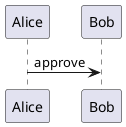

# Markdown Extensions

NEditor keeps Markdown readable while adding business-document syntax for
metadata, modular documents, governance, calculations, transforms, and export
evidence.

This page documents the author-facing syntax that is already represented in
the implementation, examples, or verification tests. The
[specification](specification.md) remains the authority for full product scope
and future extensions.

## Front Matter

Use YAML front matter at the top of a document:

```yaml
---
title: Q3 Board Paper
subtitle: Operating review and approval request
version: 1.0.0
status: approved
approvedBy: Board Secretary
approvedAt: 2026-05-20T09:00:00Z
classification: confidential
client: Acme Holdings
targetPersona:
  - Executives and managers
toc: true
citationStyle: author-year
brand:
  name: Acme Holdings
  color: "#1F6F55"
layout:
  header: "{{title}} | {{classification}}"
  footer: "Page {{page}} of {{pages}}"
---
```

Common fields:

| Field | Purpose |
| --- | --- |
| `title`, `subtitle`, `author`, `client`, `classification`, `targetPersona` | Document identity, audience, and metadata. |
| `version`, `status`, `approvedBy`, `approvedAt` | Review and release governance. |
| `toc`, `citationStyle` | Generated section and bibliography defaults. |
| `brand` | Export brand name, color, logo, fonts, and defaults. |
| `layout` | Header, footer, page, margin, column, column-gap, and flow options. |
| `variables` | Project or document values used by `{{name}}` placeholders. |

Front matter must be a YAML mapping. Invalid YAML and list/scalar front matter
produce source-ranged diagnostics so malformed metadata is visible before
preview or export.

## Includes

Master documents can include child Markdown files:

```md
!include chapters/introduction.md
{{include chapters/market-analysis.md}}
<!-- include: appendices/financials.md -->
```

Rules:

- Paths resolve relative to the current document.
- Child front matter is stripped when included.
- Missing files produce diagnostics.
- Circular includes produce diagnostics.
- Nested includes stop at a safe maximum depth.
- The include graph contributes to snapshots and export manifests.

## Generated Sections

Add markers where generated sections should appear:

```md
[TOC]
[INDEX]
[GLOSSARY]
[BIBLIOGRAPHY]
[LIST_OF_FIGURES]
[LIST_OF_TABLES]
```

`toc: true` in front matter can also request a table of contents. `index:
true`, `indexSection: true`, `index_section: true`, or `index.enabled: true`
can request a generated index without placing `[INDEX]` in the source.
`glossary: true`, `glossarySection: true`, or `glossary_section: true` can
request a generated glossary section without placing `[GLOSSARY]` in the
source.

Generated sections are built from the compiled document model, so fenced
examples are excluded from heading, caption, citation, and reference scans.

## Variables And Inline Formulas

Use front matter, project variables, calculation results, and default document
values with `{{name}}` syntax:

```md
Prepared for {{client}}.
Prepared for {{client | title}} in {{region | trim | upper}}.
Budget: {{budget | currency}}
Fallback owner: {{owner | default:"strategy office" | title}}
```

Document variable filters include `default`, `trim`, `upper`, `lower`, `title`,
`number`, `round`, `percent`, and `currency`. Unsupported filters and numeric
filters applied to non-numeric values produce source-ranged diagnostics.
Text values such as `$1,234.50` can be formatted as numbers, currency, or
rounded values, and values already written as `27.5%` keep their human
percentage scale when the `percent` filter is applied.

Inline formulas use `{{= expression }}` and can include numeric format filters:

```md
Margin: {{=margin | percent}}
After tax: {{=profit * 0.70 | currency}}
Rounded score: {{=score | round}}
```

Formula diagnostics include source ranges where possible.

## Calculation Blocks

Use `calc` fenced blocks for document-level calculations:

````md
```calc
revenue = 100
cost = 40
profit = revenue - cost
margin = profit / revenue
healthy = IF(revenue > cost, 1, 0)
```

Margin: {{=margin | percent}}
````

Supported patterns include arithmetic, percentages, named values, forward
references, table formulas, and dependency diagnostics. Circular dependencies
are reported as diagnostics.

The Templates panel includes reusable `calc` blocks for business cases such as
ROI, break-even volume, SaaS unit economics, runway, NPV, pipeline coverage,
retention, reorder points, capacity, variance, weighted scoring, and KPI
indexes; scientific cases such as dilution, molarity, ideal gas calculations,
decay, Ohm's law, density, kinetic energy, replicate summaries, and dosing; and
mathematical cases such as linear/quadratic models, distance, weighted
averages, Bayes updates, expected value, normalization, compound growth,
measurement error, and index change.

## Tables And Data Sources

Standard Markdown tables remain readable source:

```md
| Metric | Q2 Actual | Q3 Plan |
| --- | ---: | ---: |
| Revenue | 1200000 | 1450000 |
| Gross margin | 0.61 | 0.64 |
```

CSV and TSV transform blocks can render tables and evaluate formula cells:

````md
```csv caption="Quarterly rollout budget"
Quarter,Implementation,Training,Total
Q1,12000,3000,=12000+3000
Q2,18000,4000,=18000+4000
```
````

Front matter can also pull local CSV, TSV, JSON, YAML, and XLSX files into the
document as generated data source sections:

```yaml
---
dataSources:
  - name: Accounts
    path: data/accounts.json
  - name: Settings
    path: data/settings.yaml
csvFiles:
  - data/revenue.csv
xlsxFiles:
  - data/forecast.xlsx
---
```

CSV/TSV/XLSX sources render as tables, JSON arrays can render as structured
tables, common JSON/YAML row containers such as `records`, `data`, `items`, and
`values` render as captioned tables, nested object fields in those rows flatten
to dot-path columns such as `account.owner`, scalar arrays render as readable
comma-separated cells, keyed object maps such as `accounts: { acme: ... }`
render as tables with a stable key column, scalar settings maps render as
two-column field tables, and other nested JSON/YAML values render as structured
trees. XLSX data
sources import a safe default worksheet, or a selected worksheet when a
`dataSources` entry includes `sheet`/`sheetName` or one-based `sheetIndex`, and
use cached formula values when the workbook provides them. Data source paths
must stay inside the document folder by using relative child paths; absolute
paths and `..` parent-directory escapes are blocked before any file is read,
and resolved symlinks are checked before
import. Missing paths, unsupported source types, and unreadable files are
reported as diagnostics.

The table editor can write clean Markdown after paste import, CSV/TSV/XLSX
import, sorting, row and column edits, alignment, totals, formula rows, and
merged-cell metadata edits. Tables can also be exported as CSV or XLSX so a
business user can round-trip spreadsheet data without leaving Markdown as the
source of truth. Existing Markdown tables can be loaded back into the visual
grid from the Tables panel, Writing Tools menu, command palette, toolbar, or
native desktop Writing Tools menu by choosing **Edit Table at Cursor** while
the cursor or selection is inside the table; **Go to Source Table** returns the
user to the exact Markdown range being edited. Users who prefer text-first
editing can choose **Edit Table Cell at Cursor** while the source cursor is
inside a header or body cell, change that cell value in the Tables panel, and
write it directly back into the Markdown row without rebuilding the table. The
Tables panel also exposes **New table in text** and **Insert draft in text** so
a user can create a table visually, place the Markdown version in the document,
and continue editing the pipe table directly.

## Figures, Captions, And Cross References

Use extended image attributes for stable figure labels and captions:

```md
{#fig:architecture caption="System architecture"}
```

Reference labels from prose:

```md
See {@fig:architecture} for the system layout.
The result follows from equation {@eq:roi}.
```

NEditor tracks references to headings, figures, tables, equations, appendices,
and decisions. Broken references are reported in diagnostics and export
readiness. Labels must be unique across headings, figures, tables, equations,
appendices, and decisions; duplicate labels block export readiness because a
cross reference would otherwise have more than one possible target. Label and
cross-reference keys may use letters, numbers, colon, underscore, dash, and
period only. Empty keys, spaces, slash characters, and unclosed `{#` / `{@`
markers are source-ranged errors and block export manifests instead of being
silently truncated.

## Equations

Use inline and display math for business and research documents:

```md
Inline confidence is $p = 0.81$.

$$
confidence = signal / noise
$$ {#eq:confidence caption="Confidence score"}
```

Missing labels or captions can produce readiness warnings when the equation is
used in a release-grade export.
Captioned display equations render as numbered figures in preview and carry the
human caption through HTML, PDF, DOCX, PPTX, and Markdown bundle exports.
The native renderer covers common equation syntax used in business, finance,
and academic drafts, including fractions, roots, superscripts, subscripts,
Greek letters, sums, products, integrals, arrows, approximate/equality symbols,
infinity, partial/nabla symbols, and simple `matrix`, `pmatrix`, `bmatrix`, and
`vmatrix` environments. It also covers common technical-writing notation such
as piecewise `cases`, blackboard/calligraphic/roman identifiers, probability
operators, and limits while preserving the original LaTeX as the export
fallback text for Office-oriented targets.

## Citations And Bibliography

Use citation syntax in prose:

```md
Prior research on competitive advantage [@porter1985, p. 42] supports the plan.
```

Add bibliography data inline or load it through supported bibliography inputs.
Use `[BIBLIOGRAPHY]` where references should render:

```bibtex
@book{porter1985,
  title = {Competitive Advantage},
  author = {Porter, Michael E.},
  year = {1985}
}
```

BibTeX fields may be split across lines or written inline; `title`, `author`,
`year`, `date`, entry type, journal or book title, publisher, volume, issue,
pages, DOI, and URL metadata is used in bibliography previews and export
artifacts. The BibTeX reader handles `@string`, `@comment`, and `@preamble`
metadata without treating those records as bibliography entries, supports
brace or parenthesis entry delimiters, keeps `@` characters inside field values
such as URLs, and accepts dotted citation keys. CSL JSON may be a root array,
a single item object, or an object wrapping an `items`, `references`,
`bibliography`, or `data` array; publication metadata such as `container-title`,
`publisher`, `publisher-place`, `volume`, `issue`, `page`, `DOI`, `URL`,
`editor`, and issued dates is preserved and mapped into deterministic native
APA, Chicago, MLA, IEEE, Vancouver, Nature, AMA, and Elsevier-style reference
previews.

```md
[BIBLIOGRAPHY]
```

Set `citationStyle` to `title`, `author-year`, `key`, or `numeric` in front
matter. Common CSL aliases are accepted for deterministic native rendering:
`apa`, `american-psychological-association`, `chicago-author-date`, `chicago`,
`mla`, `modern-language-association`, `harvard`, and
`council-of-science-editors-author-date` use author-oriented labels while
preserving distinct APA, Chicago author-date, and MLA bibliography formatting;
`ieee`, `vancouver`, `nature`, `american-medical-association`, `ama`, and
`elsevier-vancouver` use numeric citation labels while preserving distinct IEEE
or Vancouver-style bibliography formatting. Unsupported `citationStyle` or
`cslStyle` names produce a warning and fall back to title rendering until a full
native CSL adapter is added. The References and Settings panels expose the
common aliases so document metadata and export-default preferences can use the
same supported style names.

Diagnostics cover missing keys, duplicate bibliography keys, missing
bibliography sources, and unsupported citation styles. The references panel
exposes resolved entries and problems, and can insert bibliography markers,
BibTeX templates, missing-key stubs, repeat citations, and editable entry
copies. Rendered citations are keyboard focusable and expose citation-detail
popovers in preview and HTML exports, using bibliography metadata when a key
resolves and an explicit missing-entry message when it does not.

The References panel also includes source acquisition and Deep Research
controls. Users can search DuckDuckGo, a configured SearXNG endpoint, or Tavily
for source candidates, download selected source documents into a
`<document>.neditor-sources/` directory beside the active document, insert a
CSL JSON bibliography stub, and keep a `sources.json` manifest with URL, hash,
file path, media type, download time, provider, fit score, fit reasons, and
citation-key evidence. Source-library refresh also checks whether each local
file still exists and whether its current SHA-256 hash still matches the
manifest, so the audit table can flag missing or modified evidence and the UI
can force a re-download. Candidate results are ranked by deterministic citation
fit using query-term coverage, domain/source-file signals, and review-risk hints
before users download or save them; those fit details stay with the saved source
manifest. Repeated downloads reuse the saved manifest entry when the source file
still exists, and the References panel can refresh the active document's source
library, cite a saved source again, insert its bibliography entry, link to the
local copy, insert/copy a source-library audit table, or copy/reveal the
downloaded evidence path. Missing or hash-mismatched source files show a
re-download recovery action. Users can also bulk-save every visible search
result without changing the document text. Deep
Research uses the selected AI provider, including Ollama local or remote/cloud
endpoints, to plan iterative queries, reflect on knowledge gaps, preserve found
source documents in the active document's local source library when enabled,
write a sourced Markdown draft, and expand that draft toward a user-selected
length from 1 to 200 pages. The final pass quality-assures and humanizes the
draft, adding or preserving a review handoff section for source checks,
citation TODOs, open gaps, and distribution cautions before the user inserts it
into the current file or opens it as its own editable Markdown document with
front matter, `ai-source` provenance, populated CSL JSON bibliography entries,
a source citation index containing usable `[@key]` references, a
`[BIBLIOGRAPHY]` marker, a Deep Research evidence log, and the source-library
audit when saved evidence is available. Draft, expansion, QA, and fallback
generation use the same citation-key guidance, preferring saved local
source-library keys for matching URLs and falling back to deterministic keys
for unsaved research results. The quality recommendation scan treats generated
source citation indexes as handoff evidence, not body citations, so it flags a
Deep Research report when bibliography entries exist but no inline body
citations or citation TODOs appear outside generated handoff sections. The
current-document insert action appends the same editable review package as the
standalone document flow, omitting only standalone front matter while preserving
AI provenance, bibliography data, citation index, bibliography marker, evidence
log, and source-library audit. Standalone Deep Research front matter uses the
configured business identity for owner, preparer, and organization metadata
when those profile values are available.

## Glossary And Index

Use a glossary block for definitions:

````md
```glossary
ARR: Annual recurring revenue.
NRR: Net revenue retention.
```
````

Add `[GLOSSARY]` where the generated glossary should appear. Add `[INDEX]`
where the generated index should appear. Index terms can come from headings,
glossary terms, bold terms, repeated proper nouns, and explicit index markers.

## Review Comments And Change Notes

Inline comments keep review evidence near the source:

```md
<!-- comment: author: Reviewer | at: 2026-05-20 | open | Confirm final margin assumptions. -->
```

Release readiness checks can report unresolved comments and malformed audit
metadata. Change notes use the same audit principle: author, timestamp, and
body text should be present before release-grade export.

## AI Provenance

Use `ai-source` blocks to preserve AI drafting context:

````md
```ai-source
provider: OpenAI
model: gpt-5.4
date: 2026-05-20
promptSummary: policy draft outline from internal notes
reviewedBy: Policy Team
reviewedAt: 2026-05-20T14:00:00Z
status: human-reviewed
```
````

AI-assisted sections can be marked as needing review or human-reviewed.
Readiness diagnostics report incomplete provenance metadata and invalid review
statuses.

## Transform Blocks

Fenced-code transforms produce static artifacts for preview and export.

Common transform names:

| Transform | Purpose |
| --- | --- |
| `calc` | Document calculations. |
| `chart` | Bar, horizontal bar, line, pie, area, and KPI charts. |
| `mermaid`, `pikchr`, `dot`, `graphviz`, `circo`, `neato`, `fdp`, `osage`, `twopi`, `d2`, `plantuml` | Diagrams with native fallback or trusted external engine support. |
| `csv`, `tsv`, `json`, `yaml` | Structured data rendering. |
| `sql` | Read-only SQLite query results rendered as Markdown tables. |
| `openapi`, `json-schema` | API metadata, terms/contact/license details, tags, external documentation, API operations, security requirements, request/response contracts, response headers/links/examples, callbacks, webhooks, reusable component libraries, discriminators, component schemas, nested fields, composition, object/conditional/content keywords, draft-07 tuple `items`, draft 2020-12 metadata/anchors/vocabulary, `prefixItems` tuple summaries, dynamic/recursive refs, boolean schemas, definitions, and schema constraints. |
| `bibtex`, `glossary`, `timeline`, `roadmap`, `adr`, `diff`, `qr` | Business-document artifacts and generated sections. |
| `vega-lite`, `geojson`, `topojson`, `stl` | Visual data previews with static export fallbacks. |

Accepted aliases:

| Alias | Canonical transform |
| --- | --- |
| `vegalite` | `vega-lite` |
| `jsonschema`, `schema` | `json-schema` |
| `yml` | `yaml` |
| `graph` | `dot` |

First-release native business transforms:

| Transform | Supported syntax |
| --- | --- |
| `timeline` | One event per line, usually `date: label`. Rendered as a static SVG timeline. |
| `roadmap` | One item per line, `stage: text`, with optional pipe metadata such as `status=active`, `owner=Docs`, or `due=2026-06-30`. |
| `adr` | One `key: value` row per line for fields such as `Status`, `Context`, `Decision`, and `Consequences`. |
| `diff` | Unified-diff-style text. Additions, deletions, and hunk headers are classified and summarized. |
| `qr` | UTF-8 payload text rendered as a static SVG QR code for short URLs, artifact paths, or release-pack references. |

Execution-heavy second-wave transforms such as `python`, `r`, `wavedrom`,
`nomnoml`, `latex`, and raw `html` are not first-release native transforms.
They stay deferred until NEditor has a safe sandbox or static renderer for each
one; raw HTML should be avoided for release documents.

SQL transforms are intentionally narrower than a general database console. They
run trusted SQLite queries only, require a configured `sqlite3` executable, and
accept read-only `SELECT` or `WITH` statements:

````md
```sql database="data/revenue.sqlite" caption="Revenue by region"
SELECT region, SUM(revenue) AS revenue
FROM revenue
GROUP BY region
ORDER BY revenue DESC;
```
````

Database paths should stay in the document workspace. Mutation statements,
multiple-statement batches, shell commands, and untrusted engines are rejected
before execution. Results render as Markdown tables for preview and export.

Native visual-data transform subsets:

| Transform | Native static subset |
| --- | --- |
| `vega-lite` | Inline JSON specs with `data.values`, `encoding.x.field`, optional `encoding.y.field` for `count` aggregates, optional `encoding.color.field` grouping/series, optional `encoding.size.field` bubble/symbol sizing, optional `encoding.text.field` labels, `encoding.x.title`/`encoding.y.title`, numeric y values including negatives with a real zero baseline, y aggregates (`sum`, `mean`, `average`, `avg`, `min`, `max`, `count`), and `bar`, `line`, `point`, `circle`, `square`, `area`, `tick`, `text`, or `rule` marks. Rule marks support numeric `x`/`y` field values or numeric `x.datum`/`y.datum` constants for threshold and reference-line previews. |
| `geojson` | GeoJSON Feature, FeatureCollection, GeometryCollection, Point/MultiPoint, LineString/MultiLineString, Polygon, and MultiPolygon rendered as typed static SVG map previews. Native previews mark their projection as `linear-wgs84-fit`, assume longitude/latitude coordinates, and warn when legacy `crs` metadata or out-of-range projected coordinates are detected. |
| `topojson` | Topology `arcs` arrays with optional `transform.scale` and `transform.translate`, plus object geometries that reference arcs, including reversed arc references; quantized `Point` and `MultiPoint` coordinates use the same transform so markers align with decoded arcs. |
| `stl` | ASCII STL vertex data or base64-encoded binary STL data rendered as depth-aware isometric triangle previews with per-triangle depth ordering and `z-depth` summary metadata. Binary STL can be pasted as raw base64, `base64:...`, `binary-stl:...`, or a `data:application/sla;base64,...` URI. |

Native diagram transform subsets:

| Transform | Native static subset |
| --- | --- |
| `mermaid` | Simple `flowchart` or `graph` edge diagrams such as `A[Start] --> B[End]`, including bracketed node labels and `-- label -->` edge labels. The first-release native renderer is a static preview for business flowcharts; sequence diagrams, class diagrams, state diagrams, subgraphs, styling directives, and advanced Mermaid layout features should be rendered with an external workflow before release if exact Mermaid fidelity is required. Unsupported Mermaid syntax produces a warning instead of silently implying full Mermaid compatibility. |
| `pikchr` | Simple semicolon- or line-separated statements using `box`, `circle`/`ellipse`/`oval`, `diamond`, `cylinder`, `file`, and `arrow`, including connector labels such as `arrow "approve"`. The native renderer is a static business-diagram fallback; full Pikchr grammar, positioning, macros, variables, and precise layout require a trusted Pikchr executable. Unsupported Pikchr syntax produces a warning and the external setup path remains available for high-fidelity output. |
| `d2` | Simple node declarations such as `customer: Customer`, nested container declarations such as `platform: Platform { api: API }`, relative container edges such as `api -> database: writes`, external dotted references such as `customer -> platform.api`, edge statements such as `customer -> crm: submits RFP`, semicolon-separated edge statements, and common layout/style attributes such as `direction`, `shape`, and `style.*` ignored so they do not appear as bogus preview nodes. Edge labels render in the SVG fallback. |

Example chart:

````md
```chart
type: bar
title: Regional revenue plan
data:
  - region: East
    revenue: 520
  - region: West
    revenue: 410
x: region
y: revenue
```
````

Use `type: horizontal-bar` or `type: barh` when category labels are long or
the chart is a ranked comparison. Horizontal charts support the same `target`,
`targetLabel`, `valuePrefix`, `valueSuffix`, `unit`, and multi-series fields as
standard bar charts. Business charts also accept `subtitle`, `source`,
`palette`/`colors`, row-level `color`, series-level `color`, `targetColor`,
`negativeColor`, `titleColor`, `textColor`, `mutedColor`, `axisColor`,
`background`, and `showValues: false` for board-ready scorecards and compact
exports without hand-editing SVG.

External engines are disabled until trusted. See
[External transform setup](external-transforms.md) for Graphviz, D2, PlantUML,
Pikchr, and SQLite setup.

The same Templates panel also includes starter blocks for chart, a styled
board scorecard chart, Vega-Lite grouped bars, opportunity scatter plots,
risk-score tick plots, and readiness label plots,
timeline, roadmap, ADR, Mermaid, Pikchr, DOT, PlantUML, CSV, JSON Schema,
OpenAPI endpoints, OpenAPI reusable component libraries, and QR transforms. Duplicate any built-in template to create a
workspace custom template, then edit the name, category, transform, tags, and
fenced body. Template cards expose detected fill values, such as literal `calc`
inputs or top-level structured fields, so reusable workflows are easier to
adapt after insertion.

PlantUML exports default to SVG. When a trusted PlantUML executable is
configured, request PNG output per fence with `format=png`, `output=png`, or
the `png` flag:

````md

````

## Export Readiness Markers

Before export, NEditor validates the compiled document for issues such as:

- Required metadata and release approval.
- Draft status and dirty Git state.
- Missing includes, media, citations, labels, captions, and references.
- Formula and table formula errors.
- Transform engine trust, path, timeout, stderr, output, and cache details.
- Export option shape, including citation-style defaults, brand colors, brand
  profile fields, and boolean toggles.
- Enabled appendix options that have no matching glossary, review, or AI
  provenance content.
- Unresolved comments and malformed change notes.
- Incomplete AI provenance or missing human review metadata.

Readiness diagnostics are copied into export manifests so deliverables can be
audited after the artifact leaves the editor.
