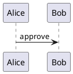

# Markdown Extensions

NEditor keeps Markdown readable while adding business-document syntax for
metadata, modular documents, governance, calculations, transforms, and export
evidence.

This page documents the author-facing syntax that is already represented in
the implementation, examples, or verification tests. The
[specification](specification.md) remains the authority for full product scope
and future extensions.

## Front Matter

Use YAML front matter at the top of a document:

```yaml
---
title: Q3 Board Paper
subtitle: Operating review and approval request
version: 1.0.0
status: approved
approvedBy: Board Secretary
approvedAt: 2026-05-20T09:00:00Z
classification: confidential
client: Acme Holdings
toc: true
citationStyle: author-year
brand:
  name: Acme Holdings
  color: "#1F6F55"
layout:
  header: "{{title}} | {{classification}}"
  footer: "Page {{page}} of {{pages}}"
---
```

Common fields:

| Field | Purpose |
| --- | --- |
| `title`, `subtitle`, `author`, `client`, `classification` | Document identity and metadata. |
| `version`, `status`, `approvedBy`, `approvedAt` | Review and release governance. |
| `toc`, `citationStyle` | Generated section and bibliography defaults. |
| `brand` | Export brand name, color, logo, fonts, and defaults. |
| `layout` | Header, footer, page, margin, column, and flow options. |
| `variables` | Project or document values used by `{{name}}` placeholders. |

Front matter must be a YAML mapping. Invalid YAML and list/scalar front matter
produce source-ranged diagnostics so malformed metadata is visible before
preview or export.

## Includes

Master documents can include child Markdown files:

```md
!include chapters/introduction.md
{{include chapters/market-analysis.md}}
<!-- include: appendices/financials.md -->
```

Rules:

- Paths resolve relative to the current document.
- Child front matter is stripped when included.
- Missing files produce diagnostics.
- Circular includes produce diagnostics.
- Nested includes stop at a safe maximum depth.
- The include graph contributes to snapshots and export manifests.

## Generated Sections

Add markers where generated sections should appear:

```md
[TOC]
[INDEX]
[GLOSSARY]
[BIBLIOGRAPHY]
[LIST_OF_FIGURES]
[LIST_OF_TABLES]
```

`toc: true` in front matter can also request a table of contents. `index:
true`, `indexSection: true`, `index_section: true`, or `index.enabled: true`
can request a generated index without placing `[INDEX]` in the source.
`glossary: true`, `glossarySection: true`, or `glossary_section: true` can
request a generated glossary section without placing `[GLOSSARY]` in the
source.

Generated sections are built from the compiled document model, so fenced
examples are excluded from heading, caption, citation, and reference scans.

## Variables And Inline Formulas

Use front matter, project variables, calculation results, and default document
values with `{{name}}` syntax:

```md
Prepared for {{client}}.
Prepared for {{client | title}} in {{region | trim | upper}}.
Budget: {{budget | currency}}
Fallback owner: {{owner | default:"strategy office" | title}}
```

Document variable filters include `default`, `trim`, `upper`, `lower`, `title`,
`number`, `round`, `percent`, and `currency`. Unsupported filters and numeric
filters applied to non-numeric values produce source-ranged diagnostics.

Inline formulas use `{{= expression }}` and can include numeric format filters:

```md
Margin: {{=margin | percent}}
After tax: {{=profit * 0.70 | currency}}
Rounded score: {{=score | round}}
```

Formula diagnostics include source ranges where possible.

## Calculation Blocks

Use `calc` fenced blocks for document-level calculations:

````md
```calc
revenue = 100
cost = 40
profit = revenue - cost
margin = profit / revenue
healthy = IF(revenue > cost, 1, 0)
```

Margin: {{=margin | percent}}
````

Supported patterns include arithmetic, percentages, named values, forward
references, table formulas, and dependency diagnostics. Circular dependencies
are reported as diagnostics.

## Tables And Data Sources

Standard Markdown tables remain readable source:

```md
| Metric | Q2 Actual | Q3 Plan |
| --- | ---: | ---: |
| Revenue | 1200000 | 1450000 |
| Gross margin | 0.61 | 0.64 |
```

CSV and TSV transform blocks can render tables and evaluate formula cells:

````md
```csv caption="Quarterly rollout budget"
Quarter,Implementation,Training,Total
Q1,12000,3000,=12000+3000
Q2,18000,4000,=18000+4000
```
````

Front matter can also pull local CSV, TSV, JSON, and YAML files into the
document as generated data source sections:

```yaml
---
dataSources:
  - name: Accounts
    path: data/accounts.json
  - name: Settings
    path: data/settings.yaml
csvFiles:
  - data/revenue.csv
---
```

CSV/TSV sources render as tables, JSON arrays can render as structured tables,
and nested JSON/YAML values render as structured trees. Missing paths,
unsupported source types, and unreadable files are reported as diagnostics.

The table editor can write clean Markdown after paste import, sorting, row and
column edits, alignment, totals, formula rows, and merged-cell metadata edits.

## Figures, Captions, And Cross References

Use extended image attributes for stable figure labels and captions:

```md
{#fig:architecture caption="System architecture"}
```

Reference labels from prose:

```md
See {@fig:architecture} for the system layout.
The result follows from equation {@eq:roi}.
```

NEditor tracks references to headings, figures, tables, equations, appendices,
and decisions. Broken references are reported in diagnostics and export
readiness. Labels must be unique across headings, figures, tables, equations,
appendices, and decisions; duplicate labels block export readiness because a
cross reference would otherwise have more than one possible target. Label and
cross-reference keys may use letters, numbers, colon, underscore, dash, and
period only. Empty keys, spaces, slash characters, and unclosed `{#` / `{@`
markers are source-ranged errors and block export manifests instead of being
silently truncated.

## Equations

Use inline and display math for business and research documents:

```md
Inline confidence is $p = 0.81$.

$$
confidence = signal / noise
$$ {#eq:confidence caption="Confidence score"}
```

Missing labels or captions can produce readiness warnings when the equation is
used in a release-grade export.
Captioned display equations render as numbered figures in preview and carry the
human caption through HTML, PDF, DOCX, PPTX, and Markdown bundle exports.
The native renderer covers common equation syntax used in business, finance,
and academic drafts, including fractions, roots, superscripts, subscripts,
Greek letters, sums, products, integrals, arrows, approximate/equality symbols,
infinity, partial/nabla symbols, and simple `matrix`, `pmatrix`, `bmatrix`, and
`vmatrix` environments.

## Citations And Bibliography

Use citation syntax in prose:

```md
Prior research on competitive advantage [@porter1985, p. 42] supports the plan.
```

Add bibliography data inline or load it through supported bibliography inputs.
Use `[BIBLIOGRAPHY]` where references should render:

```bibtex
@book{porter1985,
  title = {Competitive Advantage},
  author = {Porter, Michael E.},
  year = {1985}
}
```

BibTeX fields may be split across lines or written inline; `title`, `author`,
`year`, and `date` metadata is used in bibliography previews and export
artifacts. The BibTeX reader handles `@string`, `@comment`, and `@preamble`
metadata without treating those records as bibliography entries, supports
brace or parenthesis entry delimiters, keeps `@` characters inside field values
such as URLs, and accepts dotted citation keys. CSL JSON may be a root array,
a single item object, or an object wrapping an `items`, `references`,
`bibliography`, or `data` array.

```md
[BIBLIOGRAPHY]
```

Set `citationStyle` to `title`, `author-year`, `key`, or `numeric` in front
matter. Common CSL aliases are accepted for deterministic native rendering:
`apa`, `american-psychological-association`, `chicago-author-date`,
`chicago`, `harvard`, and `council-of-science-editors-author-date` map to the
author-year renderer; `ieee`, `vancouver`, `nature`,
`american-medical-association`, `ama`, and `elsevier-vancouver` map to the
numeric renderer. Unsupported `citationStyle` or `cslStyle` names produce a
warning and fall back to title rendering until a full native CSL adapter is
added. The References and Settings panels expose the common aliases so document
metadata and export-default preferences can use the same supported style names.

Diagnostics cover missing keys, duplicate bibliography keys, missing
bibliography sources, and unsupported citation styles. The references panel
exposes resolved entries and problems.

## Glossary And Index

Use a glossary block for definitions:

````md
```glossary
ARR: Annual recurring revenue.
NRR: Net revenue retention.
```
````

Add `[GLOSSARY]` where the generated glossary should appear. Add `[INDEX]`
where the generated index should appear. Index terms can come from headings,
glossary terms, bold terms, repeated proper nouns, and explicit index markers.

## Review Comments And Change Notes

Inline comments keep review evidence near the source:

```md
<!-- comment: author: Reviewer | at: 2026-05-20 | open | Confirm final margin assumptions. -->
```

Release readiness checks can report unresolved comments and malformed audit
metadata. Change notes use the same audit principle: author, timestamp, and
body text should be present before release-grade export.

## AI Provenance

Use `ai-source` blocks to preserve AI drafting context:

````md
```ai-source
provider: OpenAI
model: gpt-5.4
date: 2026-05-20
promptSummary: policy draft outline from internal notes
reviewedBy: Policy Team
reviewedAt: 2026-05-20T14:00:00Z
status: human-reviewed
```
````

AI-assisted sections can be marked as needing review or human-reviewed.
Readiness diagnostics report incomplete provenance metadata and invalid review
statuses.

## Transform Blocks

Fenced-code transforms produce static artifacts for preview and export.

Common transform names:

| Transform | Purpose |
| --- | --- |
| `calc` | Document calculations. |
| `chart` | Bar, line, pie, area, and KPI charts. |
| `mermaid`, `pikchr`, `dot`, `graphviz`, `circo`, `neato`, `fdp`, `osage`, `twopi`, `d2`, `plantuml` | Diagrams with native fallback or trusted external engine support. |
| `csv`, `tsv`, `json`, `yaml` | Structured data rendering. |
| `openapi`, `json-schema` | API operations, security requirements, request/response contracts, response headers/links/examples, callbacks, webhooks, discriminators, component schemas, nested fields, composition, object/conditional keywords, definitions, and schema constraints. |
| `bibtex`, `glossary`, `timeline`, `roadmap`, `adr`, `diff`, `qr` | Business-document artifacts and generated sections. |
| `vega-lite`, `geojson`, `topojson`, `stl` | Visual data previews with static export fallbacks. |

First-release native business transforms:

| Transform | Supported syntax |
| --- | --- |
| `timeline` | One event per line, usually `date: label`. Rendered as a static SVG timeline. |
| `roadmap` | One item per line, `stage: text`, with optional pipe metadata such as `status=active`, `owner=Docs`, or `due=2026-06-30`. |
| `adr` | One `key: value` row per line for fields such as `Status`, `Context`, `Decision`, and `Consequences`. |
| `diff` | Unified-diff-style text. Additions, deletions, and hunk headers are classified and summarized. |
| `qr` | UTF-8 payload text rendered as a static SVG QR code for short URLs, artifact paths, or release-pack references. |

Execution-heavy second-wave transforms such as `python`, `r`, `sql`,
`wavedrom`, `nomnoml`, `latex`, and raw `html` are not first-release native
transforms. They stay deferred until NEditor has a safe sandbox or static
renderer for each one; raw HTML should be avoided for release documents.

Native visual-data transform subsets:

| Transform | Native static subset |
| --- | --- |
| `vega-lite` | Inline JSON specs with `data.values`, `encoding.x.field`, `encoding.y.field`, numeric y values, and `bar`, `line`, `point`, or `area` marks. |
| `geojson` | GeoJSON Feature, FeatureCollection, GeometryCollection, Point/MultiPoint, LineString/MultiLineString, Polygon, and MultiPolygon rendered as typed static SVG map previews. |
| `topojson` | Topology `arcs` arrays with optional `transform.scale` and `transform.translate`, plus object geometries that reference arcs, including reversed arc references. |
| `stl` | ASCII STL vertex data rendered as projected triangle previews. |

Example chart:

````md
```chart
type: bar
title: Regional revenue plan
data:
  - region: East
    revenue: 520
  - region: West
    revenue: 410
x: region
y: revenue
```
````

External engines are disabled until trusted. See
[External transform setup](external-transforms.md) for Graphviz, D2, PlantUML,
and Pikchr setup.

PlantUML exports default to SVG. When a trusted PlantUML executable is
configured, request PNG output per fence with `format=png`, `output=png`, or
the `png` flag:

````md

````

## Export Readiness Markers

Before export, NEditor validates the compiled document for issues such as:

- Required metadata and release approval.
- Draft status and dirty Git state.
- Missing includes, media, citations, labels, captions, and references.
- Formula and table formula errors.
- Transform engine trust, path, timeout, stderr, output, and cache details.
- Export option shape, including citation-style defaults, brand colors, brand
  profile fields, and boolean toggles.
- Enabled appendix options that have no matching glossary, review, or AI
  provenance content.
- Unresolved comments and malformed change notes.
- Incomplete AI provenance or missing human review metadata.

Readiness diagnostics are copied into export manifests so deliverables can be
audited after the artifact leaves the editor.
