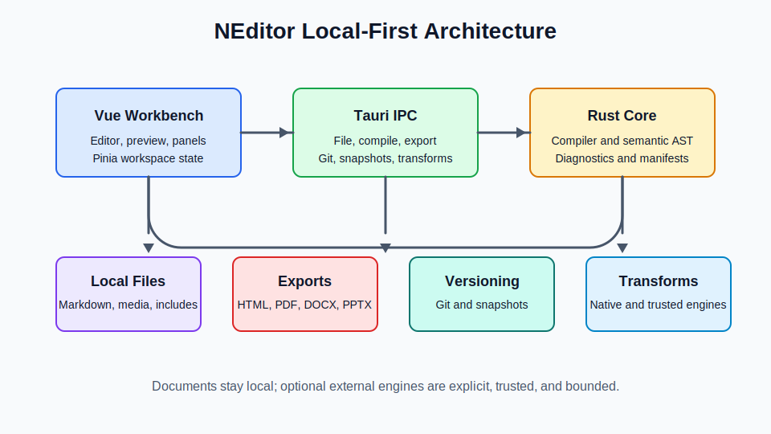

# NEditor Specification

## 1. Purpose

NEditor is a new cross-platform desktop Markdown editor built with Tauri 2. It takes the useful business-document capabilities proven in the MacDown fork and rethinks them as a modern document workbench rather than a traditional Markdown previewer.

The application must support ordinary Markdown writing, but its strategic purpose is broader:

- Produce professional business documents from plain-text sources.
- Support long-form master documents composed from many files.
- Make AI-assisted drafting easier to clean, cite, review, and govern.
- Provide stronger layout, export, versioning, bibliography, tables, equations, diagrams, and calculations.
- Preserve local-first file ownership while still enabling business workflows such as approval, review, release, and repeatable export.

The product should feel like a native desktop writing environment, not a web app wrapped in a shell. Tauri provides the desktop runtime, Vue 3 provides the interface, Rust provides file-system, compilation, export, and sandboxed execution services.

## 2. Source Prompt Extension

This specification extends the referenced Markdown editor desktop prompt with the following baseline requirements:

- Tauri 2 desktop application.
- Vue 3 with Composition API.
- Pinia for state management.
- Vanilla CSS.
- Side-by-side Markdown editor and live preview.
- Split view, preview-only mode, and focus mode.
- Local open, save, save as, and new document flows.
- Window title reflecting the current file and dirty state.
- Toolbar commands for common Markdown formatting.
- Keyboard shortcuts for common file and editing actions.
- Light/dark theme support, preferably following the operating system.
- Curated typography settings.
- Cross-platform packaging for macOS, Windows, and Linux.

NEditor keeps these requirements but expands the scope into a business-grade document system.

## 3. Product Positioning

NEditor should sit between four existing tool categories:

- Markdown editors: lightweight, file-based, fast, developer-friendly.
- Business word processors: layout, review, export, branding, page control.
- Computational notebooks: calculations, tables, charts, reproducible outputs.
- Knowledge/document systems: references, glossaries, indexes, reusable components.

The product is not intended to become a general Notion clone or a cloud-first collaborative suite in its first release. It should remain local-first and document-oriented.

## 4. Target Users

Primary users:

- Consultants writing proposals, reports, policy documents, and client deliverables.
- Technical writers maintaining manuals, architecture docs, API docs, and operating procedures.
- Researchers and analysts preparing documents with citations, tables, equations, charts, and appendices.
- Product and engineering teams producing ADRs, design docs, business cases, roadmaps, and release notes.
- Executives and managers preparing board papers, strategy documents, and operational briefings.

Secondary users:

- Students and academics who want Markdown with citations and better layout.
- Developers who want richer documentation without leaving text files.
- Teams using AI chat output as raw drafting material.

## 5. Carry-Forward Improvements From The MacDown Work

The MacDown fork work established several improvements that must be carried forward into NEditor as first-class requirements.

### 5.1 External File Refresh

MacDown was improved so that clean documents refresh when changed by another tool outside the editor. NEditor must preserve and improve this behavior.

Requirements:

- Watch open files for external modification.
- If the document has no unsaved local edits, reload automatically.
- If the document has unsaved local edits, show a non-destructive conflict prompt.
- Support compare, accept external, keep local, and save local as copy.
- Watch included files and trigger master document recompilation when includes change.

### 5.2 System CocoaPods / Build Toolchain Lessons

MacDown was updated to use the system CocoaPods toolchain and build reliably. NEditor should avoid brittle global tool assumptions.

Requirements:

- Use pinned project-local JavaScript/Rust dependencies.
- Keep build commands documented and reproducible.
- Avoid hidden global dependencies for normal development.
- Provide explicit diagnostics for missing external engines such as PlantUML, D2, Graphviz, or Pikchr.

### 5.3 Business Export Customization

MacDown added customizable HTML/PDF/DOCX/PPTX export concepts. NEditor should make export a core product surface.

Carry-forward capabilities:

- HTML export.
- PDF export.
- DOCX export.
- PPTX export.
- Page numbering.
- Headers and footers.
- Logo and brand color.
- Cover page.
- Watermarking.
- Layout presets.
- Export metadata pulled from document front matter.

NEditor should implement these through a reusable export pipeline, not one-off UI code.

### 5.4 Master Documents And Includes

MacDown added master document support with local include directives.

Supported syntax to carry forward:

```markdown
!include chapters/introduction.md
{{include chapters/market-analysis.md}}
<!-- include: appendices/financials.md -->
```

Requirements:

- Resolve includes relative to the current document.
- Strip child front matter by default.
- Detect circular includes.
- Emit readable diagnostics for missing or invalid include files.
- Re-render when included files change.
- Allow nested includes up to a safe maximum depth.
- Track the include graph for navigation and export snapshots.

### 5.5 Table Of Contents

MacDown supports `[TOC]` and front matter-driven TOC injection. NEditor should preserve and extend this.

Requirements:

- `[TOC]` marker.
- Front matter support:

```yaml
toc: true
tableOfContents: true
```

- Configurable depth.
- Optional numbering.
- Export-specific TOC formatting.
- Section links in HTML.
- Page-numbered TOC in PDF/DOCX where supported.

### 5.6 Native Tab Organization

MacDown added window tab grouping and merge behavior. NEditor should provide a stronger document workspace.

Requirements:

- Multiple open documents.
- Tabs.
- Tab groups.
- Group by folder, workspace, project, or document set.
- Pin tabs.
- Recently closed documents.
- Restore previous workspace.
- Split editor panes for comparing, drafting, and revising different parts of
  the same Markdown document.

## 6. Core Application Requirements

### 6.1 Application Shell

The app must use:

- Tauri 2.
- Vue 3 Composition API.
- Pinia.
- Vite.
- Vanilla CSS.
- Rust backend commands exposed via Tauri IPC.

Frontend component convention:

- Vue single-file components should order blocks as template, script, style.

Packaging targets:

- macOS.
- Windows.
- Linux.

Packaged builds must also include the `ned` command-line helper for scriptable
file-open handoff previews, business-template document creation, workspace
initialization, reusable business-profile setup, document inspection, export
conversion, redaction-safe publishing payload preparation for blog, Substack,
HTML, WordPress REST, Ghost Admin proxy, generic webhook, and manual publishing
handoffs, default Markdown reader setup guidance and machine-readable status
reporting, setup diagnostics, transform handler discovery, release-readiness
report inspection, release evidence report status inspection, and a
redaction-safe support bundle that combines setup diagnostics with release
evidence, spec-completion summaries, and transform-engine probe summaries plus
standard release evidence report statuses.
The CLI must support JSON output for automation and strict non-zero modes for
release gates so non-technical support teams can verify an installation without
learning the developer toolchain.
The packaged template catalog must cover common business development,
procurement, education, long-form, and media documents including proposals,
RFPs, RFP responses, RFQs, tenders, tutorials, lesson plans, lesson content,
technical textbooks, novels, podcast scripts, movie scripts, business cases, and
executive briefs.
Template discovery must be useful to non-technical users and support automation:
the CLI should expose stable IDs, human labels, categories, summaries, best-fit
uses, JSON metadata, category filters, and search filters before a user creates a
document.
Reusable document parts must also be available outside the GUI: the packaged CLI
should list, filter, search, and print standard snippet Markdown for identity,
proposal, delivery, procurement, governance, and review sections. When a
workspace business profile is available, the CLI should also be able to merge
known identity values into printed snippets while leaving unknown document-
specific placeholders visible for completion.
Reusable business identity values must be scriptable as well: the CLI should
initialize, update, inspect, and print the repeated name, email, phone, role,
company, address, website, industry, default-client, and brand-voice values used
by templates, snippets, Docs Live, and agent handoff packages.

### 6.2 Primary Layout

Default interface:

- Editor pane on the left.
- Live preview pane on the right.
- Top toolbar or command bar.
- Status bar.
- Optional left sidebar for file tree, outline, document sets, and diagnostics.

Modes:

- Split view.
- Preview only.
- Focus mode.
- Source only.
- Export preview.
- Review mode.
- Presentation outline mode.

### 6.3 Editor

Chosen editor engine:

- CodeMirror 6.

Monaco should not be used for the first implementation. The editor architecture should be Markdown-document first, with CodeMirror extensions for diagnostics, decorations, source maps, transform-aware syntax, and writing workflows.

Requirements:

- Markdown syntax highlighting.
- Line numbers toggle.
- Word wrap toggle.
- Vim/emacs-style keybindings later if feasible.
- Markdown shortcuts.
- Smart list continuation.
- Auto-pairing for brackets, quotes, code fences, and emphasis markers.
- Find and replace.
- Multi-cursor support if editor engine supports it.
- Spellcheck.
- Word count, character count, reading time.
- Outline navigation.
- Diagnostics gutter.

### 6.4 Preview

Requirements:

- Live preview updates while typing.
- Debounced rendering for large documents.
- Synchronized scrolling.
- Click heading in preview to jump to source.
- Preview theme separate from editor theme.
- Render warnings inline where appropriate.
- Support transformed fenced blocks.
- Support print/export preview mode.

### 6.5 File Operations

Requirements:

- New document.
- Open file.
- Open folder/workspace.
- Save.
- Save as.
- Revert to saved.
- Rename.
- Duplicate.
- Reveal in file manager.
- Recent documents.
- Recent folders.
- Workspace restore.
- External change detection.
- Conflict handling.

## 7. Document Model And Compiler

NEditor must not treat Markdown as a string that goes straight to HTML. It needs a compiler pipeline.

### 7.1 Pipeline

```text
Source files
  -> Load root Markdown
  -> Parse front matter
  -> Resolve includes
  -> Build source map
  -> Apply document variables
  -> Apply fenced-code transforms
  -> Resolve formulas
  -> Resolve citations
  -> Resolve cross references
  -> Generate TOC / index / glossary
  -> Produce semantic document model
  -> Render preview HTML
  -> Export HTML / PDF / DOCX / PPTX
  -> Emit diagnostics and export manifest
```

### 7.2 Compiler Outputs

The compiler must return:

- Compiled Markdown.
- Rendered HTML.
- Semantic document model.
- Diagnostics.
- Include graph.
- Source map.
- Extracted metadata.
- Bibliography data.
- Index terms.
- Formula dependency graph.
- Transform artifacts.
- Export manifest.

### 7.3 Diagnostics

Diagnostics must include:

- Severity: info, warning, error.
- Message.
- Source file.
- Source range where possible.
- Suggested fix where possible.
- Related diagnostic items for include chains or references.

Examples:

- Missing include.
- Circular include.
- Broken citation.
- Missing bibliography file.
- Formula error.
- Unknown fenced transform.
- Transform engine missing.
- Unsafe execution blocked.
- Broken image path.
- Missing title or version metadata.

## 8. Front Matter And Document Variables

NEditor documents should use YAML front matter for metadata and export controls.

Example:

```yaml
---
title: Market Entry Report
subtitle: FY27 Expansion Strategy
author: Strategy Team
version: 1.2.0
status: draft
classification: confidential
toc: true
index: true
bibliography: references.bib
csl: apa
brand:
  name: Example Corp
  color: "#275DA8"
  logo: assets/logo.png
layout:
  pageSize: A4
  columns: 2
  margins: normal
  header: "{{title}}"
  footer: "{{classification}} | Page {{page}} of {{pages}}"
---
```

Variables:

- Variables defined in front matter may be referenced in Markdown.
- Variables may be formatted with filters.
- Variables should be resolved before preview/export.

Example:

```markdown
Prepared for {{client}} on {{date}}.
```

## 9. The 20 High-Value Business Improvements

### 9.1 Git-Backed Document Versioning

Business value:

- Users need auditability, comparison, rollback, and release tagging.

Requirements:

- Detect whether a document is inside a Git repository.
- Show current branch and dirty state.
- Commit document changes from the UI.
- Show file history.
- Diff current document against previous versions.
- Restore previous revisions.
- Tag approved releases.
- Support Git-free users through local snapshots.

### 9.2 Export Snapshots

Business value:

- A business document export should be reproducible and auditable.

Requirements:

- On export, create an export manifest.
- Capture source file hash.
- Capture included file hashes.
- Capture export options.
- Capture app version.
- Capture timestamp.
- Capture document version/status.
- Optionally store manifest next to exported file.

Example manifest filename:

```text
report.pdf.manifest.json
```

### 9.3 Document Release Workflow

Business value:

- Drafts, reviews, approvals, and published versions must be explicit.

Requirements:

- Status values: draft, in-review, approved, published, archived.
- Front matter status support.
- Visual status badge.
- Export warning when status is draft.
- Optional approval metadata.
- Release tagging integrated with Git where available.

### 9.4 AI Paste Cleanup

Business value:

- Users increasingly draft in ChatGPT, Claude, DeepSeek, and similar chat tools, then paste into documents. Raw pasted output often carries bad formatting, citation gaps, repeated headings, and UI artifacts.

Requirements:

- Command: Paste from AI Chat.
- Normalize Markdown.
- Preserve code fences.
- Fix nested bullets and numbering.
- Remove chat UI labels where detected.
- Convert raw tables to Markdown tables.
- Preserve links.
- Mark missing citations as TODOs.
- Offer insertion modes: draft, quote, appendix, replace selection, merge into section.
- Optional source/provenance note.

### 9.5 AI Source And Provenance Blocks

Business value:

- Businesses need responsible AI use and review trails.

Requirements:

- Support an `ai-source` block.
- Store model, provider, date, prompt summary, reviewer, and status.
- Allow sections to be marked as AI-assisted.
- Export provenance appendix optionally.

Example:

```markdown
```ai-source
provider: OpenAI
model: ChatGPT
date: 2026-05-18
reviewedBy: Jane Doe
status: human-reviewed
```
```

### 9.6 Master Documents With Includes

Business value:

- Reports, manuals, proposals, and books are rarely one file.

Requirements:

- Include directives.
- Include graph view.
- Missing include diagnostics.
- Circular include protection.
- Re-render on child file changes.
- Export as a single document.

### 9.7 Business Table Editor

Business value:

- Tables are central to business documents and Markdown table editing is painful.

Requirements:

- Visual table editing.
- Add/remove rows and columns.
- Alignment controls.
- CSV/TSV paste.
- Sort rows.
- Format columns as text, number, currency, percent, date.
- Markdown source remains readable.
- Export tables cleanly to HTML/PDF/DOCX/PPTX.

### 9.8 Spreadsheet-Style Calculations

Business value:

- Proposals, budgets, KPIs, and reports need computed values.

Requirements:

- `calc` fenced blocks.
- Inline formulas.
- Table cell formulas.
- Named values.
- Named tables.
- Formatting filters.
- Dependency graph.
- Recalculation on edit.
- Formula diagnostics.
- No arbitrary JavaScript execution.

Example:

```markdown
```calc
revenue = 125000
cost = 74000
profit = revenue - cost
margin = profit / revenue
```

Expected margin: {{=margin | percent}}
```

### 9.9 Equation Authoring Upgrade

Business value:

- Business, academic, finance, engineering, and analytics documents need reliable equations.

Requirements:

- LaTeX math support.
- Inline and block math.
- MathJax or KaTeX rendering.
- Equation numbering.
- Equation labels.
- Cross references.
- Export support.
- Equation snippets.

### 9.10 Automatic Table Of Contents

Business value:

- Long documents need navigability.

Requirements:

- `[TOC]` marker.
- Front matter-driven TOC.
- Configurable depth.
- Optional heading numbering.
- Preview links.
- Export formatting.
- PDF/DOCX page numbers where feasible.

### 9.11 Automatic Index Generation

Business value:

- Users should not manually tag every index term.

Requirements:

- `[INDEX]` marker.
- Extract terms from headings, glossary blocks, bold terms, repeated proper nouns, and explicit index markers.
- Optional AI-assisted term suggestions later.
- Allow exclude list.
- Generate section-linked index in preview.
- Generate page-aware index in paged exports where feasible.

### 9.12 Bibliography Manager

Business value:

- Research reports and professional documents require citations.

Requirements:

- BibTeX.
- CSL JSON.
- Zotero Better BibTeX export compatibility.
- Citation syntax such as `[@porter1985]`.
- Multiple citations.
- Citation locator support.
- `[BIBLIOGRAPHY]` marker.
- CSL style selection.
- Broken citation diagnostics.

### 9.13 Cross References

Business value:

- Business documents need stable references to sections, figures, tables, equations, appendices, and decisions.

Requirements:

- Section references.
- Figure references.
- Table references.
- Equation references.
- Appendix references.
- Auto numbering.
- Rename-safe anchors.
- Diagnostics for broken references.

### 9.14 Figure And Table Captions

Business value:

- Formal documents need labeled figures and tables.

Requirements:

- Caption syntax.
- Automatic numbering.
- Cross-reference integration.
- Export support.

Example:

```markdown
{#fig:architecture caption="System architecture"}
```

### 9.15 Advanced Page Layout

Business value:

- Layout is the biggest gap between Markdown editors and business-grade documents.

Requirements:

- Page size.
- Margins.
- Columns.
- Section breaks.
- Page breaks.
- Headers.
- Footers.
- Cover pages.
- Watermarks.
- Floats.
- Captions.
- Widows and orphans.
- Print/export preview.
- Automatic reflow.
- Different layout rules per section.

Example:

```markdown
```layout
columns: 2
columnGap: 18pt
section: market-analysis
```
```

### 9.16 Brand Templates

Business value:

- Teams need consistent visual identity.

Requirements:

- Brand profiles.
- Logo.
- Colors.
- Fonts.
- Cover page layouts.
- Header/footer templates.
- Watermark presets.
- Legal disclaimers.
- Export presets.

### 9.17 Review Comments And Change Notes

Business value:

- Review workflows are essential for business documents.

Requirements:

- Inline comments.
- Resolved/unresolved state.
- Author and timestamp.
- Change notes.
- Export comments optionally.
- Review summary panel.
- Future support for external review bundles.

### 9.18 Document Variables

Business value:

- Reusable templates require stable variables.

Requirements:

- Front matter variables.
- Inline interpolation.
- Default values.
- Formatting filters.
- Diagnostics for missing variables.
- Project-level variables.

### 9.19 Pikchr Diagram Support

Business value:

- Pikchr is compact and well-suited to technical and process diagrams in Markdown.

Requirements:

- `pikchr` fenced blocks.
- Render to inline SVG.
- Source hash caching.
- Diagnostics.
- Configurable engine path.
- Later option to bundle the C implementation.

### 9.20 Business Document Validation

Business value:

- Users need confidence before sending a document to a client, board, regulator, or team.

Requirements:

- Validate required metadata.
- Validate includes.
- Validate citations.
- Validate formulas.
- Validate figures and images.
- Validate transform engines.
- Validate export settings.
- Validate broken links.
- Validate unresolved comments.
- Provide one-click "Prepare for export" report.

## 10. Fenced-Code Transform System

NEditor must support a registry of fenced-code transforms. A transform is a handler that receives code fence content and options, then returns an artifact such as HTML, SVG, a table, diagnostics, or export-specific objects.

### 10.1 Transform Architecture

```text
Markdown fence
  -> Parse info string
  -> Lookup transform
  -> Validate options
  -> Execute safe renderer or parser
  -> Cache artifact by source hash
  -> Insert preview artifact
  -> Provide export artifact
  -> Emit diagnostics
```

Each transform definition should declare:

```yaml
name: vega-lite
aliases: [vegalite]
output: svg
safeByDefault: true
requiresNetwork: false
requiresExecution: false
exportTargets: [html, pdf, docx, pptx]
```

### 10.2 Safety Rules

Requirements:

- No network access by default.
- No shell execution unless explicitly enabled.
- External engines must be invoked without shell interpolation.
- Execution timeout.
- Output size limit.
- Cache invalidation by source hash and engine version.
- Clear diagnostics when an engine is missing or disabled.

### 10.3 Core Existing / Previously Identified Transforms

These were already identified as important:

- `calc`
- `mermaid`
- `pikchr`

They remain part of the full transform set.

### 10.4 The 17 Additional High-Value Transforms

The following transforms should be supported in addition to `calc`, `mermaid`, and `pikchr`.

#### 10.4.1 `dot` / `graphviz`

Output:

- SVG.

Use cases:

- Architecture diagrams.
- Dependency graphs.
- Organization charts.
- Process graphs.

Notes:

- Support Graphviz engines such as dot, circo, neato, fdp, osage, and twopi where available.

#### 10.4.2 `plantuml`

Output:

- SVG or PNG.

Use cases:

- Enterprise architecture.
- Sequence diagrams.
- Component diagrams.
- Class diagrams.
- Deployment diagrams.

Notes:

- External engine likely required.
- Must show clear setup diagnostics.

#### 10.4.3 `d2`

Output:

- SVG.

Use cases:

- Clean architecture diagrams.
- System maps.
- Process diagrams.

Notes:

- External engine likely required initially.

#### 10.4.4 `vega-lite`

Output:

- SVG or HTML chart.

Use cases:

- Business charts.
- Data visualizations.
- KPI charts.
- Exploratory analysis.

Notes:

- Prefer static SVG export.

#### 10.4.5 `chart`

Output:

- SVG chart.

Use cases:

- Simple bar, line, pie, area, and KPI charts without requiring Vega-Lite knowledge.

Example:

```markdown
```chart
type: bar
title: Revenue by Region
data:
  - region: East
    revenue: 120
  - region: West
    revenue: 98
x: region
y: revenue
```
```

Business chart specs can also set `target`/`goal`/`benchmark` reference lines,
`targetLabel`, and `valuePrefix`/`valueSuffix`/`unit` labels. Bar, line, and
area charts must preserve negative values with a real zero baseline so variance,
cash-flow, budget, and profit/loss charts remain honest in preview and export.
Multi-series bar, line, and area charts can use `series` entries as field names
or `{ key, label }` objects for budget-vs-actual, revenue-vs-cost, segment, and
scenario comparisons while keeping the syntax business-readable.

#### 10.4.6 `geojson`

Output:

- Map preview.

Use cases:

- Territory maps.
- Site maps.
- Branch coverage.
- Regional reporting.

#### 10.4.7 `topojson`

Output:

- Map preview.

Use cases:

- Compact geographic boundary maps.
- National or regional report maps.

#### 10.4.8 `stl`

Output:

- 3D preview or static preview image.

Use cases:

- Manufacturing.
- Hardware.
- Product design.
- Facilities planning.

Notes:

- Initial implementation may show a static preview with a later interactive renderer.

#### 10.4.9 `csv`

Output:

- Rendered table.

Use cases:

- Paste spreadsheet data directly into Markdown.
- Lightweight report tables.

Requirements:

- Header detection.
- Alignment.
- Numeric formatting metadata for plain numbers, currency, percentages, and
  negative values.
- Export-safe table rendering.

#### 10.4.10 `tsv`

Output:

- Rendered table.

Use cases:

- Tab-separated data copied from spreadsheets.

#### 10.4.11 `json`

Output:

- Pretty tree, table, or code view.

Use cases:

- API examples.
- Configuration examples.
- Structured data documentation.

#### 10.4.12 `yaml`

Output:

- Pretty tree, table, or code view.

Use cases:

- Configuration docs.
- Deployment docs.
- Policy-as-code examples.

#### 10.4.13 `openapi`

Output:

- API reference section.

Use cases:

- Endpoint tables.
- Request/response documentation.
- API governance documents.

#### 10.4.14 `json-schema`

Output:

- Field reference tables.
- Boolean schemas and tuple-style array item variants are rendered as explicit
  rows instead of disappearing into empty schema summaries.

Use cases:

- Data contracts.
- API schemas.
- Event payload docs.

#### 10.4.15 `bibtex`

Output:

- Bibliography data source or rendered bibliography preview.

Use cases:

- Embedded references.
- Portable research documents.

#### 10.4.16 `glossary`

Output:

- Glossary entries and index term source.

Use cases:

- Business terminology.
- Acronyms.
- Regulatory definitions.
- Auto-index generation.

Example:

```markdown
```glossary
ARR: Annual recurring revenue.
CAC: Customer acquisition cost.
NDR: Net dollar retention.
```
```

#### 10.4.17 `timeline`

Output:

- Timeline graphic.

Use cases:

- Project plans.
- Legal histories.
- Implementation schedules.
- Audit trails.

### 10.5 Additional Later Transforms

These are useful but should be second-wave because they add execution or dependency complexity:

- `roadmap`
- `adr`
- `diff`
- `qr`
- `python`
- `r`
- `sql`
- `wavedrom`
- `nomnoml`
- `latex`
- `html`

## 11. AI-Assisted Writing Workflow

### 11.1 Paste From AI Chat

Command:

- `Edit > Paste from AI Chat`

Requirements:

- Read plain text and rich text clipboard content.
- Detect likely source patterns from ChatGPT, Claude, DeepSeek, Gemini, Copilot, and generic web chat tools.
- Normalize headings.
- Normalize bullets.
- Normalize code fences.
- Remove duplicated answer labels.
- Convert tables where possible.
- Preserve links.
- Insert citation TODOs for unsupported factual claims if citation checking is enabled.
- Optionally add provenance metadata.

### 11.2 AI Cleanup Preview

Before insertion, show:

- Original clipboard preview.
- Cleaned Markdown preview.
- Detected issues.
- Toggle options.

Options:

- Preserve original headings.
- Convert numbered lists.
- Convert tables.
- Add provenance block.
- Mark as draft.
- Insert citation TODOs.

### 11.3 AI Review Governance

Requirements:

- Mark AI-assisted sections.
- Human review checkbox.
- Track reviewer and date.
- Export AI usage appendix optionally.
- Warn before publishing if AI-assisted sections are unreviewed.

### 11.4 Agentic Step Assistance

The AI workflow should assist users at every major document step, not only after
text has already been generated.

Requirements:

- Creation, composition, editing, revision, review, and distribution plans must
  expose context-aware suggested optimal answers for each step.
- Suggestions should use the current document intent, supplied context answers,
  source pack, reusable document memory, outline, selected text, quality gates,
  and distribution targets where available.
- Users must be able to add a suggested answer into the editable context before
  replanning, instead of having the system silently fill business facts.
- Each suggestion must show the context signals and rationale that shaped it so
  non-technical users can review, accept, revise, or reject the AI advice.

## 12. Versioning And Release Management

### 12.1 Local Snapshots

For non-Git users:

- Save snapshots automatically.
- Snapshot before export.
- Snapshot on major edits.
- Snapshot before destructive operations.
- Store snapshots in a hidden sidecar directory or app data directory.

### 12.2 Git Integration

For Git users:

- Show repository state.
- Commit from app.
- View file history.
- Diff revisions.
- Restore revisions.
- Create release tags.
- Export from a clean tree warning.

### 12.3 Version Metadata

Documents should support:

```yaml
version: 1.2.0
status: approved
approvedBy: Jane Doe
approvedAt: 2026-05-18
```

## 13. Tables, Calculations, And Data

### 13.1 Table Editing

Requirements:

- Markdown table source remains canonical.
- Visual editing overlays are allowed.
- CSV/TSV paste support.
- Column formatting.
- Sorting.
- Totals.
- Formula cells.

### 13.2 Formula Engine

Requirements:

- Sandboxed expression parser.
- Named variables.
- Named tables.
- Spreadsheet-like ranges.
- Deterministic functions.
- No arbitrary code execution.

Initial functions:

- `SUM`
- `AVG`
- `MIN`
- `MAX`
- `COUNT`
- `ROUND`
- `ABS`
- `IF`
- `PERCENT`
- `CURRENCY`

### 13.3 Data Sources

Initial:

- Inline tables.
- `csv` fenced blocks.
- `tsv` fenced blocks.
- Local CSV, TSV, JSON, YAML, and XLSX files referenced from front matter.

Later:

- SQLite.
- JSON files.
- API snapshots.

## 14. Equations

Requirements:

- Inline math.
- Block math.
- Equation numbering.
- Equation labels.
- Equation references.
- Export support.
- Rendering through MathJax or KaTeX.

Example:

```markdown
The result follows from equation {@eq:roi}.

$$
ROI = \frac{Gain - Cost}{Cost}
$$ {#eq:roi}
```

## 15. Bibliography And Citations

Requirements:

- BibTeX parser.
- CSL JSON support.
- CSL style support.
- Zotero Better BibTeX compatibility.
- Citation syntax:

```markdown
This is a cited claim [@porter1985].
```

- Bibliography marker:

```markdown
[BIBLIOGRAPHY]
```

- Diagnostics for missing keys.
- Citation preview popovers.
- Bibliography panel.
- Export to HTML/PDF/DOCX.

## 16. Automatic Index And Glossary

### 16.1 Index

Requirements:

- `[INDEX]` marker.
- Automatic extraction from:
  - headings,
  - glossary,
  - bold terms,
  - repeated proper nouns,
  - explicit markers,
  - metadata-defined terms.

Explicit marker:

```markdown
Working capital{#index:Working Capital}
```

### 16.2 Glossary

Requirements:

- `glossary` fenced block.
- Dedicated glossary panel.
- Term hover cards in preview.
- Optional glossary export section.
- Glossary terms feed index generation.

## 17. Layout And Reflow

This is the most important differentiator. NEditor must support layout as document semantics, not only CSS pasted into the preview.

### 17.1 Layout Model

Requirements:

- Page size.
- Margins.
- Columns.
- Section breaks.
- Page breaks.
- Header/footer templates.
- Floating figures.
- Captions.
- Footnotes.
- Sidebars/callouts.
- Cover pages.
- Watermarks.
- Automatic reflow.
- Export target mapping.

### 17.2 Layout Directives

Example:

```markdown
```layout
columns: 2
columnGap: 18pt
header: "{{title}}"
footer: "Page {{page}} of {{pages}}"
```
```

Page break:

```markdown
{{page-break}}
```

Section break:

```markdown
{{section-break columns=2 columnGap=18pt}}
```

### 17.3 Export Mapping

HTML/PDF:

- CSS paged media where possible.
- Print styles.
- Column CSS.

DOCX:

- Section properties.
- Native headers/footers.
- Native page breaks.
- Native table structures.

PPTX:

- Slide templates.
- Section-to-slide mapping.
- Title slides.
- Agenda slides.

## 18. Export System

### 18.1 Export Targets

Required:

- HTML.
- PDF.
- DOCX.
- PPTX.
- Markdown bundle.

Later:

- EPUB.
- Reveal.js slides.
- Confluence/HTML fragment.

### 18.2 Export Options

Required:

- Include styles.
- Include syntax highlighting.
- Page numbers.
- Header.
- Footer.
- Logo.
- Brand color.
- Watermark.
- Cover page.
- Layout preset.
- Citation style.
- Include comments.
- Include provenance appendix.
- Include export manifest.

### 18.3 Export Manifest

Each export should optionally generate:

```json
{
  "documentTitle": "Market Entry Report",
  "documentVersion": "1.2.0",
  "status": "approved",
  "exportedAt": "2026-05-18T00:00:00Z",
  "sourceHash": "sha256:...",
  "includedFiles": [],
  "exportTarget": "pdf",
  "exportOptions": {}
}
```

## 19. Workspace And Tab Groups

Requirements:

- Tabs.
- Tab groups.
- Group by folder.
- Group by document set.
- Pin tabs.
- Drag tabs between groups.
- Restore session.
- Close group.
- Save group as workspace.
- Sidebar workspace browser.

## 20. Command Palette

Requirements:

- Open command palette with keyboard shortcut.
- Search commands.
- Search open files.
- Search headings.
- Search glossary terms.
- Search citations.
- Run export.
- Insert snippets.
- Run transforms.
- Show diagnostics.

## 21. Preferences

Preferences should include:

- Theme.
- Editor font.
- Preview font.
- Line height.
- Word wrap.
- Autosave.
- Snapshot frequency.
- Transform engines.
- Export defaults.
- Brand profiles.
- AI paste cleanup defaults.
- Bibliography defaults.
- Git integration.

## 22. Security And Privacy

Principles:

- Local-first.
- No network calls without explicit user action.
- No arbitrary code execution by default.
- Sandboxed transform execution.
- Clear trust model for executable blocks.
- Documents remain user-owned files.

Requirements:

- Disable executable transforms by default.
- Require explicit opt-in for Python, R, SQL, shell, or external scripts.
- External tools run with timeouts.
- External tools receive input through files/stdin, not shell interpolation.
- Show trust prompt for documents with executable transforms.
- Preserve privacy for AI paste cleanup by doing local cleanup first.

## 23. Accessibility

Requirements:

- Keyboard navigable UI.
- Screen-reader labels.
- Sufficient contrast.
- Resizable panes.
- Reduced motion option.
- High contrast theme.
- Semantic preview HTML.
- Accessible export templates.

## 24. Performance

Requirements:

- Handle large documents.
- Incremental preview updates where practical.
- Debounced compilation.
- Transform artifact caching.
- Include graph caching.
- Background compilation workers.
- Non-blocking UI during export.
- Progress reporting for expensive transforms.

Targets:

- Small document preview update under 100 ms after debounce.
- Medium document preview update under 500 ms after debounce.
- Large document remains interactive during compilation.

## 25. Suggested Technical Architecture

### 25.1 Frontend

Frontend modules:

- App shell.
- Editor pane.
- Preview pane.
- Sidebar.
- Toolbar.
- Status bar.
- Diagnostics panel.
- Export dialog.
- Preferences.
- Command palette.
- Workspace/tabs.
- Bibliography panel.
- Glossary/index panel.
- AI paste cleanup dialog.

### 25.1.1 Tauri 2 Integration Contract

The implementation should use Tauri 2 as a security-conscious native shell rather than as a permissive browser wrapper.

Required Tauri plugins:

- `@tauri-apps/plugin-dialog` for native open, save, confirmation, warning, and error dialogs.
- `@tauri-apps/plugin-fs` for scoped file reads/writes where frontend file APIs are appropriate.
- `@tauri-apps/plugin-shell` for tightly scoped external transform engines and sidecars.
- `@tauri-apps/plugin-store` or a Rust-backed store for preferences, recent workspaces, engine paths, and UI state.
- Window state support, either through the official plugin or a small Rust service.

Security requirements:

- Configure explicit file-system scopes instead of broad unrestricted file access.
- Use Rust-side file operations for complex workspace, snapshot, and export flows.
- Never invoke external transform engines through interpolated shell strings.
- Configure shell plugin command scopes for each allowed executable.
- Prefer bundled sidecars for deterministic engines where licensing and size allow it.
- Treat every executable transform as disabled until the user trusts the document or workspace.

Vite/Tauri requirements:

- Use a fixed dev server port.
- Configure `frontendDist` to point at the built Vite output.
- Prevent frontend dev tooling from hiding Rust build errors.
- Keep Tauri command names stable and versioned because frontend stores and test fixtures will depend on them.

### 25.2 State Stores

Pinia stores:

- `documents`
- `workspace`
- `editor`
- `preview`
- `compiler`
- `diagnostics`
- `exports`
- `preferences`
- `versioning`
- `transforms`
- `bibliography`
- `aiPaste`

### 25.3 Rust Backend

Rust modules:

- File system service.
- Watcher service.
- Compiler service.
- Transform registry.
- Export service.
- Git service.
- Snapshot service.
- Diagnostics service.
- External engine runner.

### 25.4 IPC Commands

Initial commands:

- `open_file`
- `save_file`
- `save_file_as`
- `watch_file`
- `compile_document`
- `export_document`
- `list_transform_engines`
- `run_transform`
- `get_git_status`
- `create_snapshot`
- `list_snapshots`
- `restore_snapshot`

Productization and setup commands:

- `pending_cli_open_paths`
- `default_markdown_reader_plan`
- `configure_default_markdown_reader`
- `create_support_bundle`

## 26. Data Storage

Application data:

- Preferences.
- Recent files.
- Recent workspaces.
- Brand profiles.
- Transform engine paths.
- Snapshot index.

Document sidecars:

- Optional export manifests.
- Optional review metadata.
- Optional local snapshots for non-Git users.

Avoid locking users into a proprietary database for normal Markdown documents.

## 27. Implementation Phases

### Phase 1: Core Editor

Deliver:

- Tauri 2 app shell.
- Vue 3 frontend.
- Editor and preview.
- Open/save/save as.
- Dirty state.
- Theme support.
- Basic Markdown rendering.
- Syntax highlighting.
- Tabs.

### Phase 2: Compiler Foundation

Deliver:

- Front matter.
- Includes.
- Include graph.
- Diagnostics.
- TOC.
- Source map.
- External file refresh.
- Transform registry skeleton.

### Phase 3: Business Export

Deliver:

- HTML export.
- PDF export.
- DOCX export.
- PPTX export.
- Export options.
- Cover pages.
- Headers/footers.
- Page numbers.
- Branding.
- Watermarks.
- Export manifests.

### Phase 4: AI Paste And Versioning

Deliver:

- Paste from AI Chat.
- AI cleanup preview.
- Provenance blocks.
- Local snapshots.
- Git status.
- Git history.
- Diff and restore.

### Phase 5: Tables, Calculations, Equations

Deliver:

- Table editor.
- CSV/TSV transforms.
- Calc blocks.
- Inline formulas.
- Table formulas.
- Math rendering.
- Equation numbering and references.

### Phase 6: Bibliography, Index, Cross References

Deliver:

- BibTeX.
- CSL JSON.
- Citation syntax.
- Bibliography rendering.
- Automatic index.
- Glossary.
- Figure/table captions.
- Cross references.

### Phase 7: Diagrams And Rich Transforms

Deliver:

- Mermaid.
- Pikchr.
- Graphviz.
- PlantUML.
- D2.
- Vega-Lite.
- Chart.
- GeoJSON.
- TopoJSON.
- STL.
- JSON/YAML/OpenAPI/JSON Schema.
- Timeline.

### Phase 8: Advanced Layout

Deliver:

- Columns.
- Section breaks.
- Page breaks.
- Reflow rules.
- Floating figures.
- Print/export preview.
- DOCX section mapping.
- PPTX layout mapping.

## 28. Acceptance Criteria

The project is acceptable when:

- A user can write and preview Markdown in split view.
- The app can open, save, save as, and reload external changes safely.
- A master document can include child Markdown files.
- The preview updates when included files change.
- Front matter controls title, TOC, export options, and variables.
- HTML, PDF, DOCX, and PPTX exports work.
- Export output supports branding, cover pages, headers, footers, page numbers, and watermarks.
- AI chat text can be cleaned and inserted.
- Documents can be snapshotted and versioned.
- Bibliography and citations work for a sample BibTeX file.
- Auto-index and glossary generation work.
- Equations render and can be referenced.
- Tables support CSV/TSV paste and formulas.
- The required fenced transforms render or produce clear diagnostics when engines are unavailable.
- Layout directives support columns, page breaks, and section-level reflow.
- The app builds on macOS, Windows, and Linux.

## 29. Non-Goals For The First Release

Do not prioritize these in the first release:

- Real-time multiplayer collaboration.
- Cloud document storage.
- Mobile apps.
- Full WYSIWYG editing.
- Arbitrary plugin marketplace.
- Server-side rendering.
- Enterprise identity management.
- Browser-based web app.

These may become later product lines, but the initial product should remain local-first and document-file centered.

## 30. Final Architecture Decisions

The following choices are final for the initial architecture. Implementation should not defer these decisions to later phases unless a selected dependency fails a license audit, cannot meet the acceptance tests, or becomes unmaintained.

### 30.1 Licensing Policy

NEditor should prefer pure open-source, permissively licensed components. Embedded dependencies, bundled sidecars, and copied source code should use one of:

- MIT.
- Apache-2.0.
- BSD-2-Clause.
- BSD-3-Clause.
- ISC.
- Zlib.
- 0BSD.

Avoid embedding or linking dependencies licensed under:

- GPL.
- LGPL.
- AGPL.
- SSPL.
- BUSL.
- Commons Clause.
- Proprietary source-available licenses.

MPL-2.0 and EPL-2.0 are not forbidden in the same way as GPL/LGPL/AGPL, but they should not be embedded in the core app unless there is a clear reason and a license review approves the exact packaging model. Prefer permissive alternatives.

External user-installed tools may be supported through optional engine adapters even when their license is less ideal, but they must not be bundled, linked, or required for core functionality. The app must show a clear "not bundled; user-installed optional engine" label for those adapters.

### 30.2 Editor Engine

Decision:

- Use CodeMirror 6 as the primary editor engine.
- Do not use Monaco for the first implementation.

Rationale:

- CodeMirror 6 is MIT licensed and designed as a modular editor toolkit.
- It is lighter than Monaco and better suited to a Markdown-first writing environment.
- Its extension model is a good fit for diagnostics, linting, source maps, folding, custom Markdown syntax, inline widgets, gutter markers, and transform-aware editing.
- Monaco is also MIT licensed and powerful, but it is optimized for VS Code-like programming workflows. NEditor needs a document workbench with Markdown-specific semantics, not a general IDE editor.

Implementation consequences:

- Build a CodeMirror extension bundle for Markdown, front matter, fenced transform syntax, citations, variables, comments, and layout directives.
- Use CodeMirror diagnostics for compiler warnings.
- Use CodeMirror decorations for unresolved references, formulas, AI provenance markers, and transform previews.
- Use CodeMirror compartments for runtime theme, typography, line wrapping, and focus mode changes.
- Keep the editor abstraction small enough that Monaco could be prototyped later, but do not design around editor interchangeability in the first release.

### 30.3 Markdown Parser And Compiler

Decision:

- Use a Rust backend parser with AST and positional information as the canonical compiler path.
- Use `markdown-rs` as the first parser candidate because it exposes mdast-style syntax trees, source positions, front matter, math-related constructs, and CommonMark/GFM-oriented parsing.
- Do not use `marked.js` or `markdown-it` as the canonical document compiler.

Rationale:

- The business features require AST transforms, source mapping, diagnostics, include graphs, formula replacement, citations, captions, cross references, and export-specific render targets.
- JavaScript string-to-HTML parsers are acceptable for simple previewers, but they are the wrong source of truth for DOCX/PPTX/PDF export and diagnostics.
- Keeping the canonical compiler in Rust gives the Tauri backend deterministic file access, caching, export, and sandbox control.

Implementation consequences:

- The Vue frontend sends document text and file identity to the Rust compiler service.
- The Rust compiler returns semantic document JSON, preview HTML, diagnostics, and source map ranges.
- The compiler performs pre-parse processing only for concerns that Markdown parsers cannot represent cleanly, such as include expansion and transform placeholders.
- Custom features should be modeled as semantic nodes, not raw HTML strings, whenever they must export to DOCX or PPTX.
- Preview HTML is an output artifact, not the document model.

Fallback rule:

- If `markdown-rs` cannot satisfy GFM table/task-list/source-map needs after a prototype, switch to `comrak` only if the license audit and AST ergonomics pass. This is a parser substitution inside the same Rust compiler architecture, not a reopening of the "JS parser vs Rust parser" decision.

### 30.4 PDF Engine

Decision:

- Use a native Rust PDF/export path built around Typst-style paged layout semantics, with generated Typst or a direct Rust layout layer as the primary PDF backend.
- Do not make browser print, headless Chromium, WeasyPrint, or platform-native print APIs the primary PDF engine.

Rationale:

- Layout is the most important differentiator. Browser print is inconsistent across platforms and weak for deterministic business exports.
- Headless Chromium produces good CSS print output, but it adds a large binary/runtime dependency and complicates packaging.
- WeasyPrint-like stacks bring non-Rust native dependencies and packaging complexity.
- Platform-native print APIs differ substantially across macOS, Windows, and Linux.
- A semantic paged-layout backend gives better control over page size, columns, headers, footers, page numbers, floats, captions, cross references, and export manifests.

Implementation consequences:

- The compiler emits a semantic paged document model.
- The PDF exporter maps that model to the chosen Rust paged-layout backend.
- CSS remains important for live preview and HTML export, but PDF must not depend on browser CSS behavior for correctness.
- Browser print may remain as a convenience fallback named "Print Preview PDF", not the authoritative business export.
- The export test suite must compare page count, heading presence, headers/footers, cover page, watermark, citations, and table rendering for representative fixtures.

### 30.5 DOCX Engine

Decision:

- Use `docx-rs` as the primary DOCX writer.
- Do not use Pandoc as the primary DOCX engine.
- Avoid a fully custom OpenXML generator except for small patches where `docx-rs` lacks a needed feature.

Rationale:

- `docx-rs` is MIT licensed and Rust-native.
- It supports the direction we need: document construction, paragraphs, runs, tables, images, headers/footers, and packaging.
- Pandoc is powerful, but it is an external conversion stack with licensing, installation, reproducibility, and customization concerns. It also weakens NEditor's own semantic document model by outsourcing too much behavior.

Implementation consequences:

- Maintain an internal DOCX adapter that maps semantic nodes to `docx-rs` structures.
- Keep all business features represented before export: captions, cross references, formulas, bibliography, glossary, and layout sections.
- Use custom OpenXML injection only through small, tested functions with fixture validation.
- Every DOCX export should include an optional export manifest alongside the `.docx`.

### 30.6 PPTX Engine

Decision:

- Use `ppt-rs` as the primary PPTX writer, subject to a first-week license and fixture validation gate.
- Build a narrow NEditor slide model above it.
- Do not use Pandoc for PPTX.
- Do not hand-write all OpenXML unless `ppt-rs` fails validation.

Rationale:

- `ppt-rs` is Apache-2.0 licensed and Rust-native.
- NEditor needs controllable slide generation from document sections, not generic Markdown-to-slides conversion.
- A narrow slide model lets the app map headings, summaries, figures, tables, charts, and speaker notes into repeatable business decks.

Implementation consequences:

- Define a `PresentationDocument` model separate from the paged document model.
- Map Markdown headings and `slide` directives to slides.
- Support title slides, agenda slides, section dividers, content slides, chart slides, table slides, and appendix slides.
- Validate generated PPTX files by opening/package-inspecting them in tests and checking required relationships, slide counts, media files, and text content.
- If `ppt-rs` fails the validation gate, switch to the `pptx` crate only if its license audit passes; otherwise implement a minimal custom OpenXML writer for the NEditor slide model.

### 30.7 Citation Engine

Decision:

- Use Hayagriva as the primary citation and bibliography engine.
- Do not use citeproc-js.
- Do not use Pandoc-backed citation processing.
- Treat citeproc-rs as a possible later adapter only if its license and maintenance status are acceptable at that time.

Rationale:

- Hayagriva is Rust-native and MIT/Apache-2.0 licensed.
- It supports bibliography data structures, BibTeX interoperability, and CSL-style citation/reference formatting.
- citeproc-js has a long history, but it would put a large JavaScript citation engine in the critical compiler path.
- Pandoc citation processing would reintroduce Pandoc as an external engine dependency and undermine deterministic native exports.

Implementation consequences:

- The compiler parses citations into semantic citation nodes.
- Bibliography sources may be BibTeX, CSL JSON, or Hayagriva YAML where useful.
- The bibliography panel should expose resolved items, missing keys, duplicate keys, and style selection.
- Citation rendering must happen before HTML/PDF/DOCX/PPTX export.
- Export tests must include single citation, multiple citation, locator, missing key, and generated bibliography fixtures.

### 30.8 Formula Engine

Decision:

- Build a small deterministic formula engine in Rust, using a permissively licensed parser helper only if it materially reduces risk.
- Use decimal arithmetic for business calculations.
- Do not use `evalexpr` because its AGPL license conflicts with the licensing policy.
- Do not use arbitrary JavaScript, Python, shell, or spreadsheet engines for default formulas.

Rationale:

- Business documents need predictable and safe formulas, not a scripting language.
- The supported language is intentionally small: arithmetic, comparisons, conditionals, aggregation functions, named variables, table ranges, and formatting filters.
- A custom evaluator avoids licensing surprises and prevents accidental arbitrary execution.
- Financial and business values should avoid binary floating-point rounding surprises.

Implementation consequences:

- Implement a Pratt parser or PEG grammar for expressions.
- Represent formulas as an AST.
- Evaluate formulas against an immutable document calculation context.
- Use decimal numbers for currency, percentages, and fixed precision values.
- Provide explicit error values such as `#DIV/0!`, `#NAME?`, `#REF?`, and `#VALUE?`.
- Support dependency analysis and cycle detection.
- Initial functions: `SUM`, `AVG`, `MIN`, `MAX`, `COUNT`, `ROUND`, `ABS`, `IF`, `PERCENT`, `CURRENCY`.
- Table formulas and inline formulas use the same evaluator.

### 30.9 Transform Execution Model

Decision:

- Use a tiered transform execution model:
  1. Rust-native transforms for data, formulas, documents, citations, glossary, index, CSV/TSV, JSON/YAML, OpenAPI, JSON Schema, timeline, roadmap, ADR, diff, and QR.
  2. WASM transforms for engines that are safe, permissively licensed, and practical to sandbox.
  3. JS-in-preview transforms only for interactive preview features that have static export fallbacks.
  4. External sidecar transforms only for engines that cannot be embedded cleanly.

Rationale:

- No single runtime fits every transform.
- Static, export-safe artifacts are required for business documents.
- Rust-native transforms are easiest to test and export.
- WASM is appropriate for safe deterministic renderers.
- JS preview-only transforms are acceptable only when export uses a cached static artifact.
- External engines must be explicit because of installation, license, and sandbox concerns.

Implementation consequences:

- Every transform declares:

```yaml
name: graphviz
licensePolicy: permissive-required
execution: rust-native | wasm | js-preview | external-sidecar
safeByDefault: true
requiresNetwork: false
requiresExecution: false
exports: [html, pdf, docx, pptx]
```

- The transform registry owns engine discovery, diagnostics, caching, and export artifacts.
- Transform output must include a static artifact whenever the document is exported.
- Transform source, options, engine version, and output hash go into the export manifest.
- External sidecars must run with timeout, argument allowlists, no shell interpolation, and output limits.

Initial transform implementation choices:

- `calc`: Rust-native.
- `csv`: Rust-native.
- `tsv`: Rust-native.
- `json`: Rust-native.
- `yaml`: Rust-native.
- `openapi`: Rust-native parser plus generated documentation nodes.
- `json-schema`: Rust-native parser plus generated table nodes.
- `bibtex`: Rust-native via bibliography service.
- `glossary`: Rust-native.
- `timeline`: Rust-native SVG.
- `chart`: Rust-native simple SVG first; optional Vega-Lite adapter later.
- `vega-lite`: JS/WASM renderer with static SVG export artifact.
- `mermaid`: JS/WASM renderer with static SVG export artifact; no live-only export dependency.
- `pikchr`: Rust-native or WASM if using permissive source; external fallback allowed.
- `dot` / `graphviz`: WASM or external sidecar depending on license/package audit.
- `plantuml`: external user-installed adapter only; do not bundle by default due Java/runtime and license complexity.
- `d2`: external user-installed adapter first; bundle only if license review approves.
- `geojson`: Rust-native validation plus JS map preview; static SVG/PNG export fallback.
- `topojson`: Rust-native validation plus JS map preview; static SVG/PNG export fallback.
- `stl`: JS preview using a permissive 3D renderer; static image export fallback.

### 30.10 Snapshot Storage

Decision:

- Store automatic snapshots in the application data directory by default.
- Store export manifests next to exported artifacts by default.
- Support optional project-local sidecar snapshots for teams that want portable history.

Rationale:

- Hidden sidecar directories in every document folder can pollute repositories and shared folders.
- App-data snapshots are safer for ordinary users and reduce accidental commits of private drafts.
- Business exports need portable evidence, so manifests should travel with exported files.
- Teams may still want project-local snapshots, but that should be an explicit workspace setting.

Implementation consequences:

- Default snapshot root:

```text
app-data/neditor/snapshots/<workspace-id>/<document-id>/
```

- Snapshot identity uses canonical file path, file-system ID where available, and content hash.
- Snapshot metadata includes source hash, timestamp, document version, status, author if known, and include graph hash.
- When a document is inside Git, snapshots still exist but Git history is shown first.
- Add `.neditor/` to generated `.gitignore` only when project-local snapshots are enabled.

### 30.11 Dependency Admission Gate

Before adding any dependency, implementation must record:

- Package name.
- Version.
- License.
- Direct dependency purpose.
- Whether it is embedded, linked, sidecar, dev-only, or optional user-installed.
- Why a simpler in-house implementation is not better.
- Export/security impact.

Reject dependencies that fail the licensing policy unless the user explicitly approves a specific exception.

## 31. Recommended First Milestone

The first milestone should not try to implement every business feature. It should prove the architecture.

Recommended milestone:

- Tauri app shell.
- Editor and preview.
- File open/save.
- Front matter.
- Includes.
- TOC.
- Transform registry.
- Mermaid and Graphviz.
- CSV table transform.
- Export to HTML/PDF.
- Export manifest.
- External file refresh.

This creates the foundation for all later improvements without overcommitting the UI or export architecture too early.
