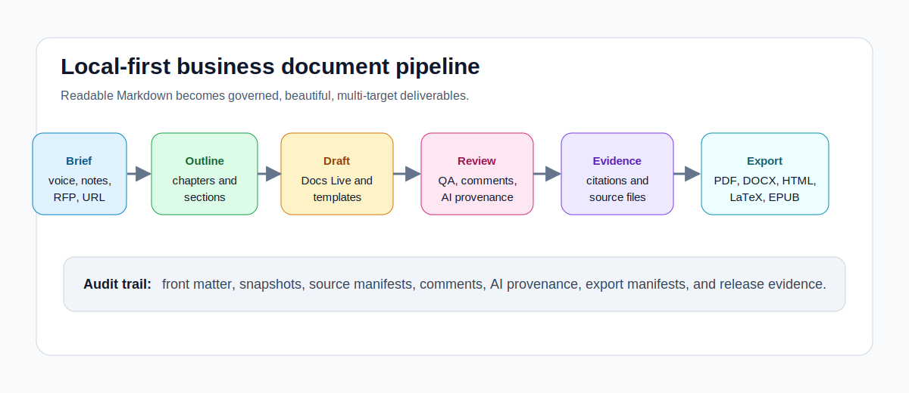
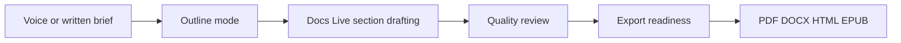
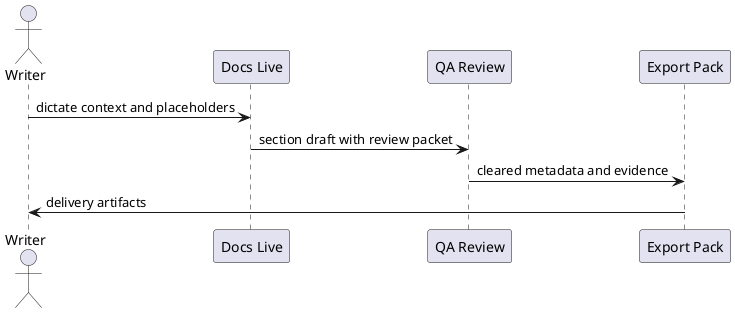

# NEditor Capability Showcase {#sec:showcase}

Prepared for {{client | title}} by {{preparer}}.

[TOC]

## 1. Executive Summary {#sec:executive-summary}

NEditor can produce a polished business document from readable Markdown while
preserving governance, evidence, review history, structured data, generated
sections, AI provenance, and repeatable exports. This exemplar intentionally
uses the extension surface that a demanding proposal, board pack, research
brief, or delivery report would need.

The showcase demonstrates ordinary prose, reusable variables, generated
sections, rich tables, calculations, equations, figures, charts, diagrams,
citations, bibliography, glossary, index, includes, layout controls, comments,
AI review metadata, change notes, source evidence, and export-ready metadata.

{#fig:value-chain caption="Local-first authoring, review, evidence, and export workflow"}

See {@fig:value-chain}, {@tbl:capability-map}, and {@eq:readiness} for the core
operating model.

<!-- comment: author: Product Reviewer | at: 2026-05-29 | open | Confirm that the final screenshots use this showcase document and not placeholder UI state. -->

## 2. Capability Map {#sec:capability-map}

Table: NEditor capability coverage {#tbl:capability-map}

| Capability family | Demonstrated in this document | Review value |
| --- | --- | --- |
| Metadata and governance | Front matter, status, owner, release target, export defaults | Makes approvals and delivery intent explicit. |
| Outline and generated sections | Numbered headings, `[TOC]`, `[INDEX]`, `[GLOSSARY]`, `[BIBLIOGRAPHY]`, figure/table lists | Creates a navigable document without manual rebuilds. |
| Layout | Page metadata, section breaks, two-column analysis, landscape appendix | Supports beautiful business documents and dense appendices. |
| Tables and data | Markdown table, CSV data, JSON/YAML data sources, formula cells | Keeps analysis inspectable and exportable. |
| Calculations | `calc` block and inline formulas | Reduces spreadsheet copy/paste errors. |
| Visuals | Image, chart, Vega-Lite, Mermaid, D2, PlantUML, timeline, roadmap, QR | Turns evidence and workflows into readable artifacts. |
| Research | Citations, BibTeX, bibliography, source manifest, citation TODO | Supports sourced claims and later audit. |
| Review | Comments, change notes, AI provenance, QA checklist | Makes document state and review obligations visible. |
| Export | HTML, PDF, DOCX, PPTX, Markdown bundle, blog, Substack, LaTeX, Google Docs, EPUB settings | Prepares one source for many handoff channels. |
| Composition | Includes and reusable sections | Builds long documents from modular content. |
| Product operations | CLI, setup, Google auth, Ollama, TTS, transform installers, default-reader setup | Documents the operational capabilities around the authoring surface. |

## 3. Financial Model And Equations {#sec:financial-model}

```calc
implementation = 285000
training = 64000
support = 92000
research = 48000
total_investment = implementation + training + support + research
year_one_benefit = 780000
net_benefit = year_one_benefit - total_investment
readiness = 0.86
weighted_score = (readiness * 70) + (0.92 * 30)
```

The proposed {{opportunityName}} requires an estimated
{{=total_investment | currency}} investment and produces a first-year net
benefit of {{=net_benefit | currency}}.

$$
Readiness = \frac{Evidence + Review + Export}{Risk + Open\ Questions}
$$ {#eq:readiness caption="Document readiness model"}

The weighted launch score is {{=weighted_score | round}} out of 100. Inline
math such as $p(success)=0.86$ remains readable in source and renders cleanly
in preview and export.

```chart
type: bar
title: Investment by workstream
subtitle: Source: showcase planning model
valuePrefix: $
data:
  - workstream: Implementation
    amount: 285000
    color: "#1F6F55"
  - workstream: Training
    amount: 64000
    color: "#2E75B6"
  - workstream: Support
    amount: 92000
    color: "#8A5A00"
  - workstream: Research
    amount: 48000
    color: "#6B4E9B"
x: workstream
y: amount
```

```csv caption="Quarterly delivery economics"
Quarter,Services,Training,Support,Total
Q1,95000,18000,21000,=B1+C1+D1
Q2,87000,22000,24000,=B2+C2+D2
Q3,62000,16000,25000,=B3+C3+D3
Q4,41000,8000,22000,=B4+C4+D4
```

```tsv caption="TSV reviewer workload plan"
Role	Hours	Review gate
Proposal strategist	12	Outline and win themes
Evidence reviewer	16	Citation and source-library audit
Export owner	6	HTML PDF DOCX EPUB package review
```

The tsv source stays editable as plain text while rendering as a reviewable workload table.

## 4. Two-Column Business Narrative {#sec:columns}

{{section-break columns=2 columnGap=20pt}}

### 4.1 Why Local-First Matters

Business documents often contain confidential assumptions, bid strategy,
unreleased financial plans, and review comments. NEditor keeps the Markdown
source, reusable snippets, snapshots, source documents, and export manifests in
ordinary local project folders.

### 4.2 Why Structured Markdown Matters

Readable Markdown keeps writing fast. NEditor extensions add the structured
parts that business users need: metadata, calculations, citations, comments,
tables, export controls, layout instructions, and provenance.

### 4.3 Why Agentic Drafting Still Needs Governance

AI can speed first drafts, RFP responses, deep research, and revision passes,
but external distribution still requires source grounding, citation checks,
human review, approval metadata, and export readiness.

{{section-break columns=1 margins=normal orientation=portrait}}

## 5. Visual Workflows And Diagrams {#sec:visual-workflows}



```d2
writer: Business writer
neditor: NEditor Workbench {
  outline: Outline Library
  editor: Markdown Editor
  preview: Live Preview
  evidence: Source Library
}
reviewer: Reviewer
writer -> neditor.outline: plans structure
neditor.editor -> neditor.preview: compiles
neditor.evidence -> reviewer: audit trail
reviewer -> neditor.editor: comments
```



```timeline
2026-05-29: Capture showcase brief | owner=Product | status=complete
2026-05-30: Generate RFP and research examples | owner=AI Wizard | status=active
2026-06-03: Review export screenshots | owner=QA | milestone=Release evidence
2026-06-07: Publish demo package | owner=Release | status=planned
```

```roadmap
Discover: Capture document intent, audience, constraints, sources | owner=Writer | status=complete
Plan: Build outline, compliance checklist, and section work queue | owner=NEditor | status=active
Draft: Generate each section with evidence and placeholders | owner=Docs Live | due=2026-06-03
Review: Run QA, humanization, citations, and export readiness | owner=Reviewer | due=2026-06-05
Distribute: Export and publish governed artifacts | owner=Release | due=2026-06-07
```

```vega-lite
{
  "mark": "bar",
  "data": {
    "values": [
      {"stage": "Outline", "hours": 2, "lane": "Plan"},
      {"stage": "Draft", "hours": 6, "lane": "Create"},
      {"stage": "Review", "hours": 4, "lane": "Review"},
      {"stage": "Export", "hours": 1, "lane": "Distribute"}
    ]
  },
  "encoding": {
    "x": {"field": "stage", "title": "Workflow stage"},
    "y": {"field": "hours", "title": "Estimated hours"},
    "color": {"field": "lane"}
  }
}
```

```qr
https://example.com/neditor/showcase
```

```geojson
{
  "type": "FeatureCollection",
  "features": [
    {"type": "Feature", "properties": {"name": "Nairobi"}, "geometry": {"type": "Point", "coordinates": [36.8219, -1.2921]}},
    {"type": "Feature", "properties": {"name": "Mombasa route"}, "geometry": {"type": "LineString", "coordinates": [[36.8219, -1.2921], [39.6682, -4.0435]]}}
  ]
}
```

```topojson
{
  "type": "Topology",
  "transform": {"scale": [0.1, 0.1], "translate": [36.0, -2.0]},
  "objects": {
    "corridor": {"type": "LineString", "arcs": [0]}
  },
  "arcs": [[[0, 0], [8, 2], [6, -1], [5, 3]]]
}
```

```stl
solid demo
  facet normal 0 0 1
    outer loop
      vertex 0 0 0
      vertex 1 0 0
      vertex 0 1 0
    endloop
  endfacet
endsolid demo
```

## 6. Structured Data, APIs, And Schemas {#sec:data}

The front matter loads local CSV, JSON, and YAML files from `data/`. The
document can also embed structured data directly when the evidence should move
with the Markdown file.

```json caption="Source acquisition manifest excerpt"
{
  "sources": [
    {
      "key": "porter1985",
      "title": "Competitive Advantage",
      "localPath": "showcase.neditor-sources/porter1985.pdf",
      "hash": "sha256-demo-porter",
      "fitScore": 0.91
    },
    {
      "key": "iso9001",
      "title": "Quality management principles",
      "localPath": "showcase.neditor-sources/iso9001.html",
      "hash": "sha256-demo-iso",
      "fitScore": 0.88
    }
  ]
}
```

```yaml caption="Reusable export profile"
profile: board-and-client-pack
targets:
  - html
  - pdf
  - docx
  - google-docs
  - epub
checks:
  approvalMetadata: required
  comments: include-appendix
  aiProvenance: include-appendix
```

```openapi
openapi: 3.1.0
info:
  title: NEditor Document Automation API
  version: 1.0.0
paths:
  /exports:
    post:
      summary: Create governed export package
      responses:
        "202":
          description: Export request accepted
components:
  schemas:
    ExportRequest:
      type: object
      required: [target, sourcePath]
      properties:
        target:
          type: string
        sourcePath:
          type: string
```

```json-schema
{
  "$schema": "https://json-schema.org/draft/2020-12/schema",
  "$id": "https://example.com/neditor/review-gate.schema.json",
  "title": "ReviewGate",
  "type": "object",
  "required": ["status", "reviewer", "approvedAt"],
  "properties": {
    "status": {"enum": ["draft", "in-review", "approved", "published"]},
    "reviewer": {"type": "string"},
    "approvedAt": {"type": "string", "format": "date-time"}
  }
}
```

SQL transforms are intentionally trust-gated because they execute `sqlite3`
against a local database. The query below is included as a governed setup
blueprint for Settings -> Transforms and the Tables panel rather than as a
live transform in this portable fixture:

```sql-query
SELECT segment, revenue, confidence
FROM pipeline
ORDER BY revenue DESC;
```

## 7. Research, Citations, And Bibliography {#sec:research}

The document can combine manually selected citations with source-library and
Deep Research evidence. Competitive strategy research [@porter1985, p. 42],
quality management guidance [@iso9001], and local-first software principles
[@kleppmann2019] all support a reviewable source-of-truth workflow.

This unsupported claim intentionally includes a review marker. <!-- TODO: citation needed -->

```bibtex
@book{porter1985,
  title = {Competitive Advantage},
  author = {Porter, Michael E.},
  year = {1985},
  publisher = {Free Press}
}

@misc{iso9001,
  title = {Quality management principles},
  author = {{International Organization for Standardization}},
  year = {2015},
  url = {https://www.iso.org/quality-management/principles}
}

@article{kleppmann2019,
  title = {Local-first software: You own your data, in spite of the cloud},
  author = {Kleppmann, Martin and Wiggins, Adam and van Hardenberg, Peter and McGranaghan, Mark},
  year = {2019}
}
```

## 8. Review, AI Provenance, And Change Control {#sec:review}

```ai-source
provider: Ollama
endpoint: http://localhost:11434
model: llama3.1
date: 2026-05-29
promptSummary: create an outline and first draft for a product showcase
reviewedBy: Product Review Board
reviewedAt: 2026-05-29T10:00:00Z
status: human-reviewed
```

```ai-source
provider: Codex
model: gpt-5.4
date: 2026-05-29
promptSummary: convert the requested capability inventory into executable Markdown
status: needs-review
```

<!-- change: author: Product Operations | at: 2026-05-29T10:15:00Z | Added comprehensive transform, governance, and export showcase sections. -->

### Review Checklist

- [x] Front matter and approval metadata present
- [x] Generated sections requested
- [x] Tables, calculations, and equations included
- [x] Figures, diagrams, charts, and structured data included
- [x] Citations and bibliography included
- [ ] Final screenshots captured from this document
- [ ] Export readiness reviewed for HTML, PDF, DOCX, LaTeX, Google Docs, EPUB, blog, and Substack

```diff
--- draft
+++ review-ready
@@
- placeholder screenshot document
+ capability showcase with real document content, evidence, and export metadata
```

```adr
Status: accepted
Context: Demo screenshots must prove document creation quality, not just UI density.
Decision: Use this showcase as the canonical screenshot and release-demo source.
Consequences: Future screenshots should open this file and show rendered sections, tables, visuals, equations, and review evidence.
```

## 9. RFP, Compliance, And Business Development Content {#sec:rfp}

NEditor can place an RFP compliance checklist after the cover and before the
table of contents, then create an evaluator-aligned proposal outline and draft
each section sequentially.

Table: Native RFP wizard output shape {#tbl:rfp-output}

| RFP element | Extracted artifact | Proposal location |
| --- | --- | --- |
| Mandatory submission gates | Critical disqualifiers checklist | After cover, before table of contents |
| Scored evaluation criteria | Weighted outline and page allocation | Technical proposal outline |
| Terms of Reference activities | Methodology section work queue | Section-by-section draft plan |
| Required roles and CV evidence | Compliance matrix and team plan | Team organization |
| Attachments and annexes | Attachment checklist | Final annex list |
| Stated and implied intent | Win themes and reviewer notes | Executive summary and methodology |

## 10. Product Operations And Distribution {#sec:operations}

This document also records operational capabilities that do not appear as a
single rendered block but are essential to a complete NEditor deployment.

Table: Operational capability inventory {#tbl:operations}

| Area | Capability shown by this showcase | Where users operate it |
| --- | --- | --- |
| CLI | `ned` opens documents, initializes workspaces, lists templates, analyzes RFPs, converts/export targets, deploys global CLI, and reports readiness | File menu, Settings -> Files, terminal |
| Setup | Identity, LLM access, local agents, Google auth, TTS, transforms, exports, and default-reader setup are centralized | Configuration Center |
| AI providers | Ollama local/cloud, OpenAI-compatible APIs, Claude Code, Codex, OpenCode, and Google Antigravity handoffs | AI Agent Workspace and Settings |
| Voice and TTS | Dictation, read selected text, read whole document, macOS Say, browser speech, and consent-gated Supertonic model download | Writing toolbar and Settings |
| Publishing | Blog, Substack, webhook, WordPress REST, Ghost proxy, Google Docs package, LaTeX, and EPUB handoffs | Export panel and Publish actions |
| Packaging | Homebrew, sidecar CLI, default Markdown reader setup, signing/notarization evidence, and support bundles | Release runbooks and `ned` |
| Data workflows | CSV/XLSX import, Markdown table editing, CSV/XLSX export, SQL transform setup, and local data source sections | Tables panel and References panel |
| Help | Hover help, command palette, guided demo, user guide, markdown extension reference, and release documentation | Help menu and documentation |

## 11. Modular Include Content {#sec:includes}

The next two sections are pulled in from sibling Markdown files. They demonstrate
master documents, reusable sections, and include graph evidence in snapshots and
export manifests.

!include includes/showcase-client-context.md

{{include includes/showcase-risk-register.md}}

## 12. Generated Lists And Back Matter {#sec:back-matter}

[LIST_OF_FIGURES]

[LIST_OF_TABLES]

[GLOSSARY]

[INDEX]

[BIBLIOGRAPHY]
