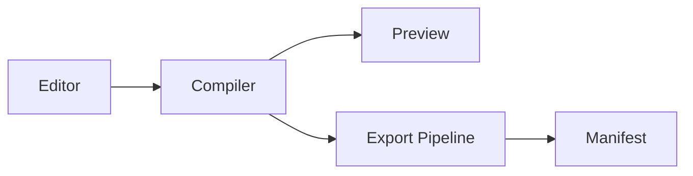

# Local Document Automation Architecture

[TOC]

## Context

The system keeps document compilation, export, and file ownership local while
allowing optional user-installed transform engines.



## Components

```timeline
2026-05-20: Local compiler baseline
2026-06-03: Desktop workflow smoke tests
2026-06-17: Export fixture audit
```

```adr
Status: accepted
Decision: Keep Rust compiler as the export source of truth
Consequence: Browser preview cannot become the authoritative PDF backend
```

## Export Boundary

All business export targets consume the semantic document model rather than raw
preview HTML.
