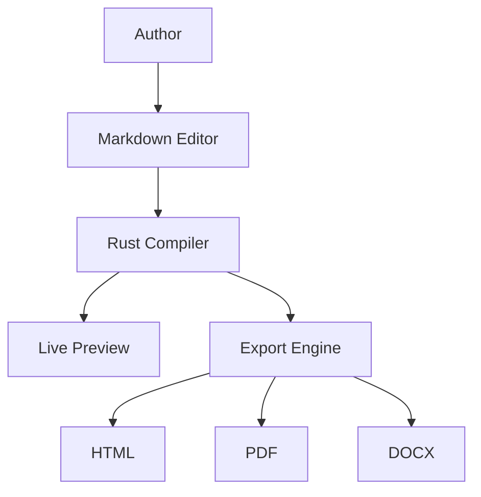

# Platform Architecture Overview

[TOC]

## System Context

The platform is a local-first document workbench. All editing and compilation
happen on the author's device — no background cloud sync, no server-side
rendering pipeline.


```mermaid
flowchart TD
  Author[Author] --> Editor[Markdown Editor]
  Editor --> Compiler[Rust Compiler]
  Compiler --> Preview[Live Preview]
  Compiler --> Export[Export Engine]
  Export --> HTML[HTML]
  Export --> PDF[PDF]
  Export --> DOCX[DOCX]
```

<!-- comment: author: Engineering Lead | at: 2026-06-01 | resolved | Confirm that the export engine diagram matches the v2 release. -->

## Delivery Timeline

```timeline
2026-04-01: Core Markdown compiler | owner=Core | status=complete
2026-05-01: Transform pipeline | owner=Transforms | status=complete
2026-06-01: Export engine v1 | owner=Export | milestone=Release v1
2026-07-01: AI-assisted drafting | owner=AI | status=planned
```

## Architecture Decision Record

```adr
Status: accepted
Context: The document compiler must produce deterministic output across platforms.
Decision: All rendering logic runs in a Rust library crate compiled for desktop via Tauri.
Consequences: No server dependency; offline-first by design; test coverage via cargo test.
```

## Component Inventory

| Component | Language | Responsibility |
| --- | --- | --- |
| Compiler | Rust | Markdown → HTML, source maps, diagnostics |
| Transform pipeline | Rust | Code fence → SVG/HTML artifacts |
| Export engine | Rust | HTML → PDF/DOCX/PPTX/ZIP |
| Frontend | Vue 3 | Editor UI, live preview, IPC |

## Key Design Constraints

1. All computation is local — no network calls during compilation.
2. Output is deterministic — same source produces identical artifacts.
3. Diagnostics are structured — severity, line, column, suggestion.
